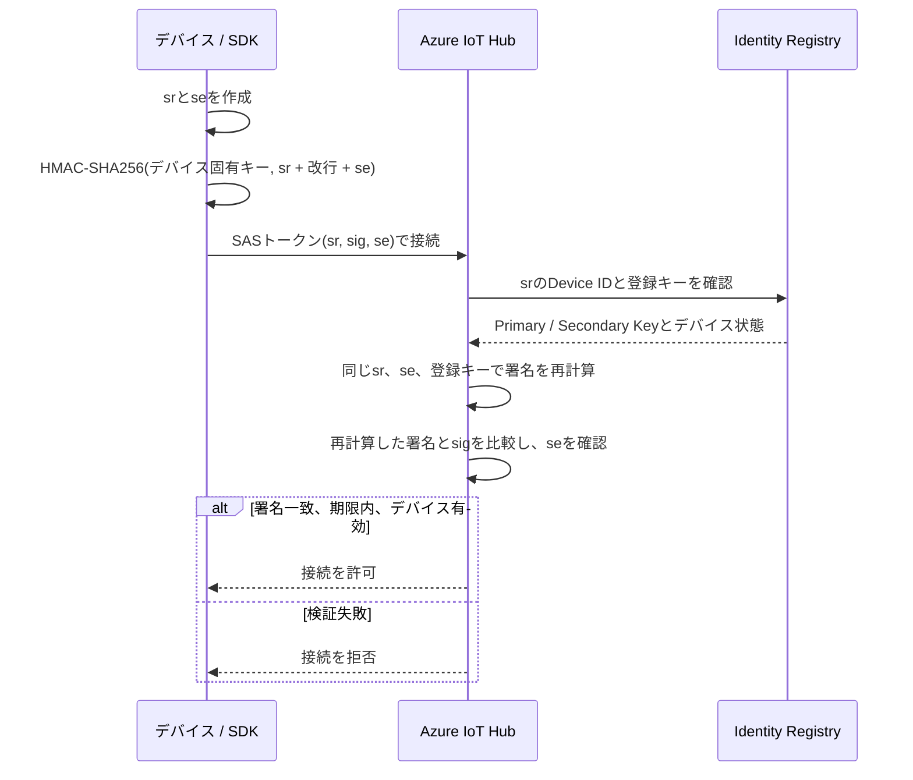

# IoT Hub 通信プロトコル Q&A

## Q. MQTT 8883 と MQTT over WebSockets 443 の違いは？

- MQTT 8883 は、MQTTをTLS/TCP上で直接送る。
- MQTT over WebSockets 443 は、MQTTパケットをWebSocketフレームに格納し、TLS/TCP 443で送る。
- IoT Hubで利用できる機能は基本的に同じ。8883を許可できないネットワークでは443を検討する。
- WebSocketには追加のフレーミングがあるため、直接MQTTより少しオーバーヘッドが増える。
- IoT Hubは暗号化されていないMQTT 1883をサポートしない（[IoT HubのMQTTサポート](https://learn.microsoft.com/ja-jp/azure/iot-hub/iot-mqtt-connect-to-iot-hub)）。

## Q. WebSocketが必要なのは、双方向チャネルを常時開くため？

- いいえ。通常のMQTT 8883自体が常時接続と双方向通信に対応する。
- WebSocketを使う主な理由は、MQTT専用ポート8883が閉じられた環境で、通しやすい443を利用するため。
- 443が開いていても、プロキシなどがWebSocketへのUpgradeを拒否すると接続できない。

## Q. HTTPSとWebSocketの違いは？

- HTTPSは、基本的にクライアントからのHTTPリクエストとサーバーからのHTTPレスポンスで通信する。
- WebSocketは、1本の接続を維持し、クライアントとサーバーの双方が任意のタイミングで送信できる。
- WebSocketは最初にHTTP Upgradeを行い、成功後はHTTPではなくWebSocketフレームを交換する。
- HTTPSとWebSocket Secure（WSS）はどちらもTLS/TCP 443を使用できるが、中の通信手順が異なる（[WebSocketの動作](https://learn.microsoft.com/ja-jp/azure/application-gateway/application-gateway-websocket#how-does-websocket-work)）。

## Q. MQTT over WebSocketsは、MQTTをHTTPS形式でカプセル化する？

- 厳密には、MQTTパケットをHTTPSメッセージではなくWebSocketのバイナリフレームに格納する。
- HTTPを使うのは、主に最初のWebSocket Upgradeハンドシェイク。
- 接続確立後も同じTLS/TCP 443接続を使い続け、別ポートには移動しない。

```text
MQTT over WebSockets: MQTT -> WebSocket -> TLS -> TCP 443
HTTPS:               HTTP -> TLS -> TCP 443
```

## Q. HTTPSは通信のたびにTLSハンドシェイクする？

- 必ずしも毎回ではない。
- TCP/TLS接続を再利用すれば、1回のTLSハンドシェイク後に複数のHTTPリクエストとレスポンスを送受信できる。
- HTTPメッセージは、HTTP/1.1では開始行、ヘッダー、空行、本文から構成される。
- 本文の終端は`Content-Length`、チャンク、HTTPフレームなどで判定し、通常は`END`のような文字列を流すわけではない。

## Q. IoT HubでAMQPを使うメリットは？

- 1本のAMQP/TLS接続上に複数の論理的なセッションやリンクを作れる。
- IoT Hubでは、複数のデバイスIDの通信を1本または少数の接続へ多重化できる。
- 多数のデバイスを集約するフィールドゲートウェイやIoT Edgeの上流通信に適している。
- 単体デバイスの直接接続では、一般に実装が比較的軽量なMQTTが使いやすい（[IoT Hubの通信プロトコル選択](https://learn.microsoft.com/ja-jp/azure/iot-hub/iot-hub-devguide-protocols)）。

## Q. Protocol Gatewayを設ける場合は必ずAMQPを使う？

- 必ずではない。
- 配下の各デバイスIDをIoT Hub上でも維持し、物理接続をまとめたい場合はAMQPが有力な候補。
- Gateway自身を1つのデバイスIDとして登録し、配下の機器IDをペイロードに含めて集約送信する場合はMQTTも利用できる。
- 事例図に`Protocol Gateway`と書かれているだけでは、実際の上流プロトコルは特定できない。

## Q. IoT EdgeからIoT Hubへの上流通信はAMQP？

- IoT Edge Hubの既定の上流プロトコルはAMQP。
- AMQPでは、モジュールや下流デバイスの論理接続を1本の物理接続へ多重化できる。
- 上流をMQTTへ変更することもできるが、その場合は各モジュールや下流デバイスが個別のIoT Hub接続を使用する。
- 下流側と上流側のプロトコルは別に選択できる（[IoT Edge Hubのクラウド通信](https://learn.microsoft.com/ja-jp/azure/iot-edge/iot-edge-runtime#iot-edge-hub)）。

## Q. MQTTで接続を多重化できないのは、ペイロードにデバイスIDを入れられないから？

- いいえ。ペイロードには任意のデバイス識別情報を含められる。
- IoT Hubでは、1つのMQTT接続が1つの認証済みデバイスIDと資格情報に対応する。
- ペイロードに別の`deviceId`を書いても、IoT Hubから見た送信元は接続時に認証されたデバイスのまま。
- 各機器を独立したIoT Hub Device IDとして扱うには、MQTTでは原則としてデバイスごとの接続が必要。

## Q. AMQPの多重化はプロトコル仕様？ Azureの仕様？

- 両方が関係する。
- 1本のAMQP接続内に複数のセッションやリンクを持てるのはAMQP 1.0の仕様。
- 各リンクをデバイスID、資格情報、D2C/C2Dのパスへ対応付けるのはIoT Hubの仕様。
- AMQP規格自体はAzureのDevice IDを認識しない（[IoT HubのAMQPサポート](https://learn.microsoft.com/ja-jp/azure/iot-hub/iot-hub-amqp-support#device-client)）。

## Q. VLANのようなイメージ？

- 「物理的な経路は1本、論理的な経路は複数」という点では似ている。
- VLANは主にデータリンク層でネットワークを分割する仕組み。
- AMQPのセッションやリンクはアプリケーション層のメッセージ経路。
- 厳密には、HTTP/2の1接続内に複数ストリームを流す仕組みに近い。

## Q. 今回のPythonデモでは、どのプロトコルを使っている？

- `azure-iot-device` 2.xのPython Device SDKは、既定でMQTT/TLS 8883を使用する。
- コードでプロトコルを指定しなかったのは、SDKがMQTTを選択しているため。
- `websockets=True`を指定すると、MQTT over WebSockets 443へ変更できる。

```python
device_client = IoTHubDeviceClient.create_from_connection_string(
    connection_string,
    websockets=True,
)
```

- 今回のDPSクライアントもMQTTを使用する（[Python SDKのMQTT利用](https://learn.microsoft.com/ja-jp/azure/iot-hub/iot-mqtt-connect-to-iot-hub#use-the-device-sdks)）。

## Q. AMQP対応SDKなら、プロトコル指定を変えるだけで使える？

- 単一のDevice IDを接続するだけなら、基本的にはクライアント作成時のトランスポート指定をAMQPへ変更すればよい。
- 指定方法はSDKごとに異なり、別のトランスポートパッケージが必要な場合もある。
- ただし、通常のDevice ClientをAMQPへ変更しただけでは、複数Device IDの接続が自動的に多重化されるわけではない。
- 多重化には、.NETのAMQP接続プールやJavaの`MultiplexingClient`など、SDK固有の設定やAPIが必要になる（[IoT Hubの通信プロトコル選択](https://learn.microsoft.com/ja-jp/azure/iot-hub/iot-hub-devguide-protocols)）。

## Q. AMQP対応SDKでも、単体デバイスでAMQPを使わない理由は？

- 単体デバイスでは接続多重化の恩恵がなく、MQTTより構成が複雑になりやすい。
- MQTTライブラリは一般にAMQPライブラリよりフットプリントが小さく、Microsoftも複数Device IDを1本のTLS接続へまとめる必要がないデバイスにはMQTTを推奨している（[IoT Hubの通信プロトコル選択](https://learn.microsoft.com/ja-jp/azure/iot-hub/iot-hub-devguide-protocols)）。
- テレメトリ、Device Twin、Direct Methodなど、通常のデバイス機能はMQTTとAMQPの両方で利用できるため、単体デバイスをAMQPへ変更しても機能が大きく増えるわけではない（[D2C通信ガイダンス](https://learn.microsoft.com/ja-jp/azure/iot-hub/iot-hub-devguide-d2c-guidance)、[C2D通信ガイダンス](https://learn.microsoft.com/ja-jp/azure/iot-hub/iot-hub-devguide-c2d-guidance)）。
- MQTT/TLSはTCP 8883、AMQP/TLSはTCP 5671を使用する。5671が閉じている環境では、AMQP over WebSockets 443が必要になる（[IoT Hubのポート番号](https://learn.microsoft.com/ja-jp/azure/iot-hub/iot-hub-devguide-protocols#port-numbers)）。
- したがって、単体デバイスではMQTTを既定候補とし、Gatewayで複数Device IDを集約して接続数を減らす場合にAMQPと多重化APIを検討する。

## Q. Python Device SDKでAMQPへ変更できる？

- 今回使用している`azure-iot-device` 2.xでは、AMQPトランスポートを選択できない。
- これはIoT Hubの制限ではなく、Python Device SDKの対応範囲。
- IoT Hub自体はAMQPに対応し、C#、Java、Node.jsなどにはAMQP対応のDevice SDKがある。
- PythonでAMQPを直接実装することは可能だが、IoT Hub固有の認証、リンク、トークン更新、再接続などを自分で扱う必要があり、今回の入門デモには適さない。

## Q. 講義ではどこまで扱う？

- 第3章でMQTT、AMQP、HTTPS、WebSocket経由のポートと選択基準を説明する。
- 単体デバイスはMQTT、複数デバイスIDの接続多重化が必要なGatewayはAMQPを検討する、という判断軸を示す。
- 第7章では、採用ポート、WebSocket Upgrade、プロキシ、DNS、TLSが本番ネットワークで許可・動作するかを確認事項として扱う。
- Protocol Gatewayの事例図から、実際の採用プロトコルを断定しない。

## Q. Shared access policyはすべてRBACに置き換えるべき？

- バックエンドや運用ユーザーは、原則としてMicrosoft Entra IDとAzure RBACを使用する。
- デバイス接続はEntra IDに対応していないため、デバイス固有の対称キーまたはX.509証明書を使用する。
- DPSを利用するIoT Hubでは、shared access policyを無効化するとプロビジョニングに影響するため注意する（[IoT HubのEntra IDアクセス制御](https://learn.microsoft.com/ja-jp/azure/iot-hub/authenticate-authorize-azure-ad)）。

## Q. Azure IoT Explorerにshared access policyは必要？

- デバイス管理はEntra IDサインインとRBACでも行える。
- 組み込みエンドポイントからテレメトリを監視する機能には接続文字列が必要。
- 別の宛先へメッセージルーティングして読む場合、この制約は関係しない。
- 接続文字列を使う場合は、`iothubowner`ではなくExplorer専用の最小権限ポリシーを使用する。

## Q. Shared access policyの4つの権限は？

- `Registry Read`: デバイス／モジュールIDを参照する。
- `Registry Write`: デバイス／モジュールIDを作成、更新、削除する。
- `Service Connect`: Twin、Direct Method、C2D、テレメトリ受信などのクラウド側操作を行う。
- `Device Connect`: テレメトリ送信、C2D受信、Reported Properties更新などのデバイス側操作を行う。
- IoT Explorer用には通常、`Registry Read`、`Registry Write`、`Service Connect`を使用する（[SASによるIoT Hubアクセス制御](https://learn.microsoft.com/ja-jp/azure/iot-hub/authenticate-authorize-sas#access-control-and-permissions)）。

## Q. Device Connectとデバイス固有キーは同じ？

- 異なる。デバイス固有キーは、そのDevice IDだけに使用できる。
- `Device Connect`を持つshared access policyのキーは、IoT Hub内の複数デバイスとして接続できる強い共有キー。
- 実デバイスには配布せず、デバイス固有キーまたはX.509証明書を使用する。

## Q. デバイス接続文字列とSASトークンの関係は？

- デバイス固有キーは、IoT Hubとそのデバイスだけが共有する対称キー。
- デバイス接続文字列は、`HostName`、`DeviceId`、`SharedAccessKey`をまとめた設定値であり、SASトークンそのものではない。
- SASトークンは、デバイス固有キーから生成する有効期限付きの認証情報。

```text
デバイス固有キー -> デバイス接続文字列 -> SASトークン -> IoT Hubへ接続
```

## Q. SDK利用時もSASトークンを生成している？

- `create_from_connection_string()`を使うと、SDKが接続文字列を解析し、内部でSASトークンを生成する。
- SDKが有効期限に応じたトークン管理を行うため、通常はアプリからSAS生成処理が見えない。
- 生成済みトークンを渡す`create_from_sastoken()`では、アプリ側が期限切れ前に新しいトークンを用意する（[Python IoTHubDeviceClient API](https://learn.microsoft.com/python/api/azure-iot-device/azure.iot.device.iothubdeviceclient?view=azure-python)）。

## Q. IoT HubはSASトークンをどう検証する？

- SASトークンには、対象URIの`sr`、署名の`sig`、有効期限の`se`が含まれる。
- デバイス側は、`URLエンコードしたsr + 改行 + se`をデバイス固有キーでHMAC-SHA256署名する。
- IoT Hub側もIdentity Registryに登録された同じキーで署名を再計算し、受信した`sig`と比較する。
- IoT Hubは署名の一致に加えて、`se`が期限切れでないことと、対象Device IDが有効であることを確認する。



## Q. SASトークンの有効期限はどこで決まる？

- デバイスまたはSDKが有効期限`se`を決め、SASトークンに含めてIoT Hubへ渡す。
- `se`は署名対象なので、発行後に期限だけを書き換えると署名検証に失敗する。
- Python SDKでは通常は既定TTLを使用し、必要に応じて`sastoken_ttl`で指定できる。
- 接続文字列と元のデバイス固有キー自体には自動的な有効期限はなく、キー更新またはデバイス無効化まで新しいSASを生成できる（[SASトークンの生成](https://learn.microsoft.com/ja-jp/azure/iot-hub/authenticate-authorize-sas#generate-sas-tokens)）。

## Q. SASは安全？ 署名を盗まれるとキーを復元される？

- HMAC-SHA256は一方向の署名計算であり、署名から元のキーを現実的に復元することはできない。
- ただしSASはBearerトークンなので、トークン全体が漏れると有効期限まではそのまま再利用される可能性がある。
- IoT Hubとの通信はTLSで保護し、SASを短寿命かつDevice ID単位に限定する。
- デバイス固有キーが漏れると新しいSASを生成し続けられるため、キーの安全な保管とローテーションが必要。
- shared access policyのキーはIoT Hub全体へ影響するため、デバイスへ配布しない。

## Q. SASトークンのTTLが過ぎたらSDKが再生成する？

- `create_from_connection_string()`または`create_from_symmetric_key()`では、SDKが元の対称キーを保持するため、SASを自動更新できる。
- Python SDKの既定TTLは3600秒で、期限切れ後ではなく約120秒前に新しいSASを生成する。
- 接続中は、新しいSASでIoT Hubへ再認証して同じクライアントの処理を継続する。
- 切断中に更新された場合は、次回接続時に新しいSASを使用する。
- プロセスを再起動した場合も、接続文字列から新しいSASを生成する。
- `create_from_sastoken()`ではSDKが元のキーを持たないため、アプリ側で新しいSASを生成し、`update_sastoken()`で渡す必要がある（[Python IoT SDKのSAS更新処理](https://github.com/Azure/azure-iot-sdk-python/blob/main/azure-iot-device/azure/iot/device/common/pipeline/pipeline_stages_base.py)）。

```text
create_from_connection_string()
    -> SASを生成
    -> connect()で認証
    -> 期限の約120秒前にSASを再生成
    -> 接続中なら再認証
    -> 同じクライアントで処理を継続
```

# X.509証明書認証 Q&A

## Q. デバイス認証で自己署名証明書が本番環境に推奨されないのはなぜ？

- 自己署名証明書の暗号方式が直ちに弱いからではなく、証明書の発行、登録、更新、失効、監査をデバイスごとに管理する必要があるため。
- IoT Hubの拇印認証では、デバイスごとの証明書拇印をIdentity Registryへ登録する。台数が増えると登録とローテーションの負担が大きくなる。
- CA署名方式では、登録・検証したルートCAまたは中間CAを基点として、複数のデバイス証明書を同じ信頼体系で管理できる。
- Microsoftは自己署名証明書をテスト用途に限定し、本番環境では発行CAによる署名証明書を推奨している（[IoT HubのX.509証明書](https://learn.microsoft.com/ja-jp/azure/iot-hub/reference-x509-certificates#self-signed-certificates)）。

## Q. 証明書はデバイスごとに別のものを使う？

- 原則として、物理デバイスごとに固有の秘密鍵とリーフ証明書を使用し、複数台で使い回さない。
- 同じ証明書と秘密鍵を共有すると、IoT Hubからは同じデバイスIDとして見え、個体識別、個別失効、監査ができない。
- 1台から秘密鍵が漏えいした場合、同じ認証情報を持つ全デバイスになりすまされる。
- 複数デバイスで共通化するのは、ルートCAや中間CAの公開証明書であり、リーフ証明書と秘密鍵ではない。
- DPSでは、リーフ証明書がデバイスを一意に識別し、そのCNがregistration IDになる（[DPSのX.509証明書構成証明](https://learn.microsoft.com/ja-jp/azure/iot-dps/concepts-x509-attestation#understand-the-x509-certificate-chain)）。

```text
ルートCA（共通）
    -> 中間CA（製品や工場単位で共通）
             -> Device-A証明書 + Device-A専用秘密鍵
             -> Device-B証明書 + Device-B専用秘密鍵
             -> Device-C証明書 + Device-C専用秘密鍵
```

## Q. 証明書認証では何を確認している？

- リーフ証明書により、接続しているデバイスの識別子と公開鍵を確認する。
- Proof of Possessionにより、接続元がその公開鍵に対応する秘密鍵を保持していることを確認する。
- CA署名方式では、証明書チェーンを検証し、信頼したCAがデバイス識別子と公開鍵の対応を承認したことを確認する。
- 証明書が保証するのは、デバイス識別子、公開鍵、信頼した発行プロセスの対応関係。正規品としての信頼性は、製造時の鍵格納、CSR確認、秘密鍵保護などの運用にも依存する。

## Q. ルートCAは自社CAとパブリックCAのどちらを使う？

- IoT Hubだけを接続先とする閉じたIoTシステムでは、自社CAを利用できる。DPSやIoT HubへCAを明示的に登録するため、ブラウザーなどから広く信頼されている必要はない。
- 第三者の製品やサービスも同じ証明書を検証する場合や、CAの秘密鍵管理と監査を自社で運用できない場合は、パブリックCAやマネージドPKIを検討する。
- 自社ルートCAが自己署名であること自体は正常。避けるべきなのは、各デバイスのリーフ証明書を信頼階層なしに自己署名し、大量運用する構成。
- 自社CAでは、ルートCAをオフラインで保護し、製品や工場ごとの中間CAからデバイス証明書を発行する構成が基本となる。

## Q. 中間CA発行のリーフ証明書は、ルートCAまで自動的に検証される？

- 条件が整っていれば、DPSがリーフから登録済みの信頼アンカーまで証明書チェーンを検証する。
- ルートCAをDPSへ登録・検証した場合は、デバイスがリーフ、中間CA、ルートCAまで検証可能なチェーンを提示する必要がある。
- 中間CA自体を登録・検証した場合は、その中間CAが信頼アンカーとなるため、通常はリーフから中間CAまでで信頼が成立する。
- DPSが不足する中間証明書をインターネットから自動取得することは前提にしない。必要な中間証明書をデバイス側のfull-chain証明書へ含める。
- 検証済み証明書までチェーンを構築できない場合、DPSの認証は失敗する（[DPSのX.509証明書構成証明](https://learn.microsoft.com/ja-jp/azure/iot-dps/concepts-x509-attestation#authentication-using-x509-certificates)）。

## Q. 個別登録の拇印認証なら、デバイス側はリーフ証明書だけでよい？

- IoT Hubへ直接拇印登録する場合は、クライアント認証用としてリーフ証明書と対応する秘密鍵があればよい。信頼の根拠はCAチェーンではなく、事前登録した拇印との一致になる。
- DPSの個別登録で自己署名証明書を使う場合も、リーフ証明書と対応する秘密鍵で認証でき、CA登録は不要。
- DPSの個別登録でCA署名証明書を使う場合は、リーフ証明書を個別登録することに加え、署名チェーン上のCAをDPSへ登録・検証し、デバイスから検証済みCAまでのチェーンを提示する。
- デバイスがDPSやIoT Hubを正規のサーバーとして検証するためのAzure側ルートCA証明書は、デバイス自身を認証するリーフ証明書とは別に必要。
- DPSの個別登録では、自己署名証明書または証明書チェーンのどちらも使用できる（[DPSでHTTPSとX.509証明書を使用する](https://learn.microsoft.com/ja-jp/azure/iot-dps/iot-dps-https-x509-support#create-a-device-certificate)）。

## Q. 自己署名リーフ証明書では、なぜCAが不要？

- DPSの個別登録では、特定のリーフ証明書自体を信頼対象として事前登録するため。
- DPSは提示された証明書の拇印が登録値と一致することと、デバイスが対応する秘密鍵を保持していることを確認する。
- 信頼の根拠は自己署名そのものではなく、管理者がそのリーフ証明書を安全な経路でDPSへ登録したことにある。
- CAが必要になるのは、個々のリーフ証明書を事前登録せず、特定のCAが発行した証明書群をまとめて信頼する場合。

```text
自己署名 + 個別登録:
    登録済みリーフ証明書の拇印 -> 提示されたリーフ証明書と照合

CA署名 + Enrollment group:
    登録済みCA -> 提示されたデバイス証明書のチェーンを検証
```

## Q. CA署名証明書でも、リーフ証明書と拇印を登録する？

- 登録方式によって異なる。
- IoT Hubの`x509_thumbprint`方式では、CA署名証明書であってもリーフ証明書の拇印を登録し、CAは登録しない。この場合、CAの信頼性は認証判断に利用されない。
- DPSの個別登録でCA署名証明書を使う場合は、リーフ証明書のプライマリまたはセカンダリ拇印に加え、署名チェーン上のCAを登録・検証する。
- DPSのEnrollment groupでは、個々のリーフ証明書や拇印を登録せず、ルートCAまたは中間CAを登録する。

| 構成 | リーフ拇印 | CAの登録・検証 |
| --- | --- | --- |
| IoT Hub直接・拇印認証 | 必要 | 不要 |
| DPS個別・自己署名 | 必要 | 不要 |
| DPS個別・CA署名チェーン | 必要 | 必要 |
| DPS Enrollment group | 不要 | 必要 |

## Q. DPSへCAを登録するとは何をすること？

- DPSの`Certificates`に、ルートCAまたは中間CAの公開証明書をアップロードする。CAの秘密鍵はアップロードしない。
- CA証明書を`Verified`にし、そのCAを管理する権限があることを確認する。
- 自社所有のCAとして登録時に自己申告で検証する方法と、DPSが発行したverification codeを含む検証用証明書へCA秘密鍵で署名するProof of Possessionの方法がある。
- Enrollment groupを使う場合は、検証済みCAまたはその配下の中間CAをグループへ関連付ける。
- CAの検証により、第三者が公開されているCA証明書だけを入手し、自分のDPSでデバイス群を不正に登録することを防ぐ（[DPSでCA証明書を検証する](https://learn.microsoft.com/ja-jp/azure/iot-dps/how-to-verify-certificates)）。

## Q. 内部CAもDPSでCA証明書として扱える？

- 扱える。パブリックCAである必要はない。
- X.509のCA証明書として正しく構成され、デバイス証明書まで署名チェーンを構築でき、DPSで登録・検証されていることが必要。
- 一般にCA証明書は`Basic Constraints: CA=TRUE`を持ち、証明書署名に使用できる鍵用途を持つ。デバイスのリーフ証明書は`CA=FALSE`とする。
- 内部CAはOSやブラウザーで信頼されていなくても、DPSへ明示的に登録・検証することで、そのDPSインスタンスの信頼アンカーになる。

## Q. DPSポータルの個別登録画面には、どの証明書を配置する？

- 個別登録画面の「プライマリ証明書ファイル」には、そのデバイスのリーフ証明書を登録する。
- 「セカンダリ証明書ファイル」は証明書ローテーション用の予備であり、省略できる。プライマリとセカンダリのCNは、同じデバイスを示すregistration IDにする。
- CA署名されたリーフ証明書を使う場合は、DPSリソースの`Certificates`に内部ルートCAまたは中間CAの公開証明書を別途登録して`Verified`にする。
- デバイスには、リーフ証明書、対応する秘密鍵、検証済みCAまでのチェーン構築に必要な中間証明書を配置する。
- 個別登録にはリーフ証明書、DPSの証明書管理には内部CAの公開証明書を配置する、という分担になる（[DPSのX.509個別登録](https://learn.microsoft.com/ja-jp/azure/iot-dps/iot-dps-https-x509-support#use-an-individual-enrollment)、[署名証明書のアップロードと検証](https://learn.microsoft.com/ja-jp/azure/iot-dps/iot-dps-https-x509-support#upload-and-verify-a-signing-certificate)）。