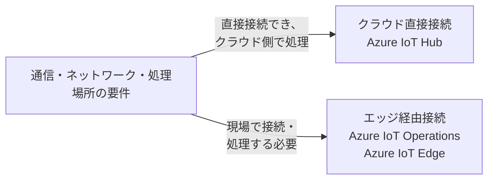
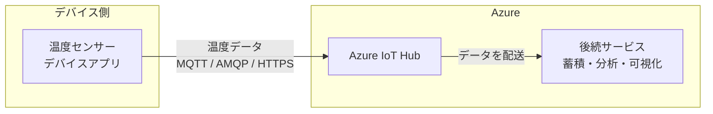
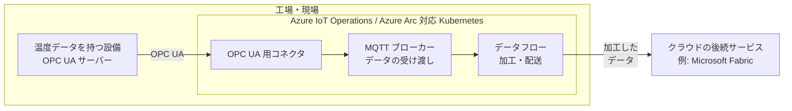
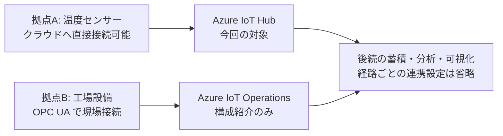

# 第02章 接続パターンとサービスの選択

## この原稿の位置づけ

- 元原稿: [outline.md](outline.md)。元の4枚構成を具体化したスライド本文案。
- 対象者: これから Azure IoT Hub を使い始める人。通信プロトコルの事前知識は不要。
- 到達点: クラウド直接接続とエッジ経由の違いを説明し、今回の講義が IoT Hub への直接接続を扱うと理解できる。
- 想定時間: 7分（参考値）。[アジェンダ](../../agenda.md)の方針に従い、フォーカスポイントに応じて調整する。
- 扱わない内容: サービスの網羅的な選定、エッジ環境の構築、認証・通信機能の詳細、分析基盤の実装。
- 構成上の判断: 要件、直接接続、エッジ経由、ハイブリッドと今回の対象範囲を説明する4枚構成とする。枚数は固定の制約ではなく、説明の流れに応じて変更できる。比較は接続の入口に絞る。
- 編集方法: 「投影本文」はスライドに載せる原稿、「図の構成」は配置・関係の指定、「講師ノート」は口頭補足。出典は該当する本文に併記し、PowerPoint 化するときも該当ページにリンクを残す。
- 以下の工場・温度センサーは説明用の仮定であり、特定の顧客の採用構成ではない。
- 技術情報の確認日: 2026-09-08。

## スライド一覧

| 番号 | タイトル | 時間 | このページで新たに分かること | 主なビジュアル |
| --- | --- | --- | --- | --- |
| 02-01 | 接続パターンを決める3つの要件 | 1分 | 接続先を考える前に確認する条件 | 要件から接続パターンへの分岐図 |
| 02-02 | IoT Hub へのクラウド直接接続 | 1分45秒 | デバイスとクラウドの接続関係 | 温度センサーから IoT Hub への構成図 |
| 02-03 | エッジ経由接続: IoT Operations と IoT Edge | 2分15秒 | IoT Operations の構成と IoT Edge の位置づけ | 現場とクラウドを分けた構成図と IoT Edge の紹介 |
| 02-04 | ハイブリッド構成と今回の対象範囲 | 2分 | 拠点ごとの使い分けと本編の範囲 | 2経路の構成図と4行の比較表 |

---

## 02-01 接続パターンを決める3つの要件

### このページの役割

前章の「デバイスからクラウドへデータを送る」という全体像を前提に、その接続方法が一つではない理由を説明する。サービス名の比較に入る前に、接続場所を判断する軸を置く。

### 投影本文

**同じ温度データでも、現場の条件によって接続先が変わる。**

| 確認する要件 | 具体的な問い |
| --- | --- |
| 通信方式 | デバイスはクラウド向けに通信できるか。設備との通信に OPC UA などを使うか。 |
| ネットワーク | デバイスからクラウドへの接続を許可できるか。現場のネットワーク内に限定する必要があるか。 |
| 処理する場所 | クラウドで処理できるか。通信遅延や切断に備えて、現場側で処理する必要があるか。 |

クラウド直接接続では **Azure IoT Hub**、エッジ経由接続では **Azure IoT Operations** や **Azure IoT Edge** を検討する（[Azure IoT とは](https://learn.microsoft.com/ja-jp/azure/iot/iot-introduction)、[IoT Edge の概要](https://learn.microsoft.com/ja-jp/azure/iot-edge/about-iot-edge)）。

**接続パターンは、サービス名ではなく通信・ネットワーク・処理場所の要件から考える。**

### 図の構成

- 左側に3つの問い、右側に分岐図を配置する。通信方式だけで自動的に決まるフローチャートにはしない。
- 分岐線には判断理由を付け、製品の優劣を示す上下関係にしない。

図は上記の公式資料を基にした接続パターンの概念図であり、製品選定を確定する診断ではない。

### 講師ノート

- 目安: 1分。
- 導入例: 「工場の温度を集める場合でも、センサーから直接送れる場合と、設備側のデータを現場で取り出す場合があります」。
- 「エッジ」は、デバイスや設備に近い現場側の実行環境を指す言葉として説明する。
- OPC UA の仕組みやネットワーク設計には踏み込まず、用語は03ページで補う。
- 次への接続: 「まず、今回の講義とデモで使う直接接続を見ます」。

---

## 02-02 IoT Hub へのクラウド直接接続

### このページの役割

前ページの判断軸を、今回扱う構成に当てはめる。デバイスアプリ、IoT Hub、後続処理の位置を示し、次章で説明する IoT Hub の役割の前提を作る。

### 投影本文

**デバイスアプリがクラウドへ直接接続し、IoT Hub を通じてデータを送受信する。**

- **接続するもの:** 温度センサーなどのデバイス上で動くアプリ。IoT Hub は MQTT、AMQP、HTTPS によるデバイス接続をサポートする（[通信プロトコルの選択](https://learn.microsoft.com/ja-jp/azure/iot-hub/iot-hub-devguide-protocols)）。
- **適する条件:** デバイスからクラウドへ通信でき、分散したデバイスのデータをクラウド側へ集めたい（[Azure IoT とは](https://learn.microsoft.com/ja-jp/azure/iot/iot-introduction#cloud-connected-pattern)）。
- **役割の分担:** IoT Hub はデバイスとの通信を担い、蓄積・分析・可視化は後続のサービスで行う（[Azure IoT とは](https://learn.microsoft.com/ja-jp/azure/iot/iot-introduction#services-and-applications)）。

**今回の想定: ローカル PC のプログラムを温度センサーに見立て、IoT Hub に直接接続する。**

### 図の構成

- 中央に横長の構成図、下部に今回の想定を置く。
- 左を「デバイス側」、右を「Azure」とし、IoT Hub がクラウド側にあることを明確にする。
- 矢印はこのページでは温度データの向きだけを示す。双方向通信の詳細は第04章へ回す。

図は上記の公式資料を基に簡略化したもの。後続サービスへの配送設定や中継処理は省略している。

### 講師ノート

- 目安: 1分45秒。
- MQTT・AMQP・HTTPS は「デバイスとクラウドが通信するときの方式」と説明する。3種類すべてを同時に使う意味ではない。
- ここでの「直接」は現場のエッジ処理基盤を経由しない意味。ネットワーク機器が存在しない意味ではない。
- デバイス ID、資格情報、SDK、IoT Hub の通信機能は次章以降で説明する。
- 次への接続: 「では、工場設備が直接クラウドへ送信できない場合はどうするでしょうか」。

---

## 02-03 エッジ経由接続: IoT Operations と IoT Edge

### このページの役割

直接接続との違いを「設備の接続先」と「処理する場所」で示す。IoT Operations の構成を例に、現場側の実行環境を説明する。IoT Edge は別の選択肢として見出し付きで紹介し、現場でのコンテナー実行と IoT Hub への接続を伝える。詳細比較や構築手順には入らない。

### 投影本文

**IoT Operations の構成例: 設備のデータを現場で収集・加工し、クラウドへ送る。**

- **設備との接続:** OPC UA は産業機器のデータ交換の標準。コネクタが設備のデータを取得し、MQTT ブローカーへ発行する（[OPC UA 用コネクタとは](https://learn.microsoft.com/ja-jp/azure/iot-operations/discover-manage-assets/overview-opc-ua-connector)）。
- **現場での処理:** MQTT ブローカーでデータを受け渡し、データフローで加工・配送する。実行基盤は **Azure Arc 対応 Kubernetes**（[Azure IoT Operations とは](https://learn.microsoft.com/ja-jp/azure/iot-operations/overview-iot-operations)）。
- **検討する条件:** 産業プロトコルへの対応、現場での低遅延処理、設備からの直接インターネット接続の制限がある場合（[Azure IoT とは](https://learn.microsoft.com/ja-jp/azure/iot/iot-introduction#edge-connected-pattern)、[OPC UA 用コネクタとは](https://learn.microsoft.com/ja-jp/azure/iot-operations/discover-manage-assets/overview-opc-ua-connector)）。

**IoT Operations の注意: オフライン動作は最大72時間で、機能が低下する可能性がある。完全閉域での無期限運用を前提にしない。**（[Azure IoT Operations とは](https://learn.microsoft.com/ja-jp/azure/iot-operations/overview-iot-operations)）

**Azure IoT Edge: もう一つのエッジ接続の選択肢**

デバイス上でコンテナー化した処理を実行し、**IoT Hub へのゲートウェイ**としても利用できる。**現在もサポートされている**（2026-09-08 確認。本章では紹介のみ）（[IoT Edge の概要](https://learn.microsoft.com/ja-jp/azure/iot-edge/about-iot-edge)、[ゲートウェイ](https://learn.microsoft.com/ja-jp/azure/iot-edge/iot-edge-as-gateway)、[サポート期間](https://learn.microsoft.com/ja-jp/azure/iot-edge/version-history)）。

### 図の構成

- 上半分に構成図、下半分に接続・処理の説明と注意事項を置く。オフライン条件を脚注だけに隠さない。
- 「工場・現場」の枠内に設備と実行基盤を配置し、クラウドとの境界を明示する。
- MQTT ブローカーは「データの受け渡し」、データフローは「加工・配送」と図中で説明する。
- 下部の IoT Edge は独立した見出しと本文で示す。上の構成図と72時間の条件は IoT Operations の説明であり、IoT Edge に適用する図・条件ではない。

図は IoT Operations の公式概要を基にしたデータ経路の概念図。Azure Arc などの管理通信は省略している。階層化されたネットワークでも Azure への通信経路を構成するため、「設備が直接接続しない」と「現場全体が Azure に接続しない」は区別する（[階層化されたネットワーク](https://learn.microsoft.com/ja-jp/azure/iot-operations/manage-layered-network/concept-layered-network)）。

### 講師ノート

- 目安: 2分15秒。
- 「工場内の設備から OPC UA で温度を読み出す」という例に限定して説明する。すべての設備が OPC UA を使うという意味ではない。
- Kubernetes は現場側のサービスを動かす基盤、Azure Arc はその環境を Azure から管理する仕組みとして位置づけ、構築手順には入らない。
- 低遅延が必要なら処理場所を現場に置く、という判断を説明する。特定の応答時間や安全制御を保証する説明にはしない。
- Azure Device Registry は、設備・デバイスの情報を Azure リソースとして管理する役割。温度データの中継先とは分けて説明する（[Azure IoT サービスを選択する](https://learn.microsoft.com/ja-jp/azure/iot/iot-services-and-technologies#azure-device-registry)）。
- 次への接続: 「全拠点を同じ方式にそろえる必要はありません。両方を使う構成もあります」。

---

## 02-04 ハイブリッド構成と今回の対象範囲

### このページの役割

前の2ページで示した接続を一つの図で比較する。ハイブリッドを第三の製品として扱わず、要件に応じた組み合わせとして説明し、本編の対象を確定する。

### 投影本文

**ハイブリッドは、クラウド直接接続とエッジ経由接続を組み合わせる構成。** 拠点や設備の要件に合わせて使い分ける（[Azure IoT サービスを選択する](https://learn.microsoft.com/ja-jp/azure/iot/iot-services-and-technologies#choose-a-solution-type)）。

| 現場の要件 | 接続パターン | 中心となるサービス |
| --- | --- | --- |
| デバイスが直接クラウドへ接続できる | クラウド直接接続 | Azure IoT Hub |
| OPC UA などで設備に接続し、現場側で処理する | エッジ経由接続 | Azure IoT Operations |
| デバイス上でコンテナー処理を行い、IoT Hub へ接続する | エッジ経由接続 | Azure IoT Edge + IoT Hub |
| 直接接続とエッジ経由の要件が混在する | ハイブリッド | 要件に応じて組み合わせる |

表は選択肢の例であり、採用を確定する選定表ではない（[サービスの選択](https://learn.microsoft.com/ja-jp/azure/iot/iot-services-and-technologies)、[IoT Edge の概要](https://learn.microsoft.com/ja-jp/azure/iot-edge/about-iot-edge)）。

**今回扱う範囲: デバイスアプリ → IoT Hub → データの受信・デバイス操作。**

### 図の構成

- 上半分に2経路、下半分に比較表と今回の対象範囲を配置する。
- 図は IoT Operations を使う併用例。表では IoT Edge と IoT Hub を使う選択肢も別行で示し、エッジ経由が IoT Operations だけだと誤解させない。
- 上段のデバイスと IoT Hub に「今回の対象」と明記する。下段には「構成紹介のみ」と添え、色だけで区別しない。
- 両経路の右端に共通の「後続の蓄積・分析・可視化」を配置する。具体的な連携設定は第05章以降の担当として省略する。

図は説明用のハイブリッド構成例。IoT Operations の後続に必ず IoT Hub を置く、という直列構成ではない。IoT Operations はデータフローから Microsoft Fabric などのクラウドエンドポイントへ接続できる（[Azure IoT Operations とは](https://learn.microsoft.com/ja-jp/azure/iot-operations/overview-iot-operations#connect-to-the-cloud)）。

### 講師ノート

- 目安: 2分。比較と図を約1分、理解度確認を約30秒、次章への接続を約30秒で説明する。
- 結論: 「直接接続かエッジ経由かを要件から考えます。エッジ経由には IoT Operations のほか、IoT Edge と IoT Hub を使う選択肢もあります」。
- 蓄積・分析・可視化の要件は接続方式と別の検討軸。Azure Device Registry の管理の役割と、Microsoft Fabric などのデータ活用の役割を混同しない（[Azure IoT とは](https://learn.microsoft.com/ja-jp/azure/iot/iot-introduction#services-and-applications)）。
- 理解度確認: 「工場設備は OPC UA、別拠点のセンサーは直接クラウドに接続できます。すべてを同じ方式にする必要がありますか？」
- 想定回答: 「ありません。工場設備は IoT Operations、直接接続のセンサーは IoT Hub を中心に、ハイブリッド構成を検討できます」。
- 次章への接続: 「ここからは上段に絞り、IoT Hub に接続するデバイスアプリと、受信・操作するバックエンドの役割を見ていきます」。