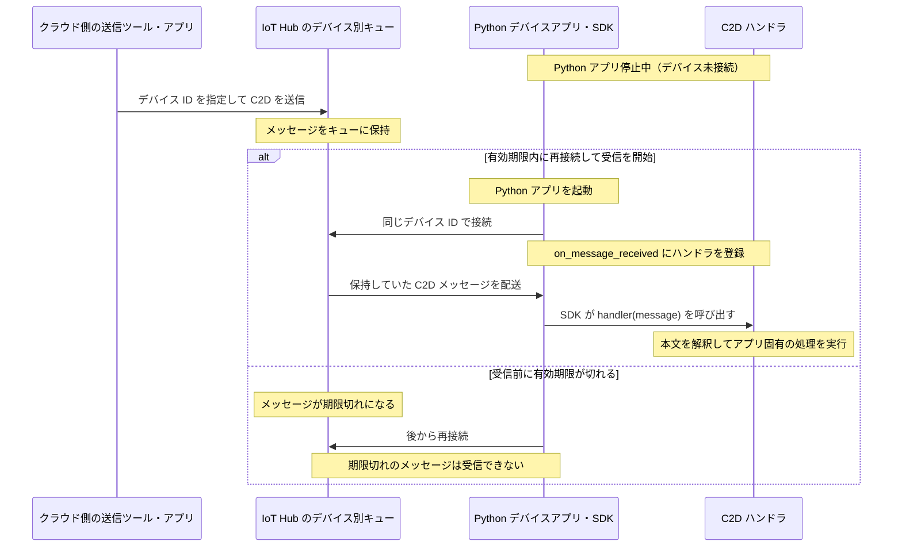

# 4. デバイスの制御と状態同期

## この章の目的
クラウドからデバイスへ働きかける複数の方法を、用途とオフライン時の挙動で使い分けられるようにする。

## 聞き手に持ち帰ってほしいこと
- 即時操作は Direct Method、期待構成の同期は Device Twin、通知は C2D メッセージが基本
- Desired Properties の更新は、デバイスへの適用完了を意味しない
- 実際の適用状態は Reported Properties で確認する

## 扱う内容
### Cloud-to-Device の使い分け
| 方法 | 主な用途 | オフライン時 |
| --- | --- | --- |
| Direct Method | 即時操作し、その場で応答を確認する | 接続待ち時間内に接続できなければ失敗。後日配送用のキューには保持しない |
| Device Twin の Desired Properties | デバイスを最終的に期待する構成へ合わせる | 値が保持される |
| C2D メッセージ | デバイスへの一方向通知 | 一定期間キューに保持される |

### C2D を使う具体的な場面

C2D は「デバイスに単発の通知や依頼を届けたいが、その場で実行結果を待つ必要はない」場面で選ぶ。公式の位置づけはデバイスアプリへの一方向通知であり、以下はその性質を使った講義用の設計例である（[通信方式の選択ガイド](https://learn.microsoft.com/ja-jp/azure/iot-hub/iot-hub-devguide-c2d-guidance)）。

| 場面 | 送る内容の例 | C2D を選ぶ理由 |
| --- | --- | --- |
| 現場端末へのお知らせ | 「本日18時からメンテナンス予定」 | 即時の実行結果ではなく、利用者への通知が目的。予定を過ぎた通知が届かないよう有効期限も考える |
| 診断ログの取得依頼 | 「依頼 ID 123 のログをアップロードして」 | 受信後に処理すればよく、その場で完了を待たない。完了確認が必要なら別途結果を報告する |
| データ到着の通知 | 「処理対象のデータが準備できた」 | デバイスがデータを取得・処理するきっかけにする |

選定では「即時の応答が必要か」「継続的な設定・状態か」「遅れて届いても意味があるか」を確認する。例えば、今回のデモに当てはめると次のように整理できる（[用途と保持特性の比較](https://learn.microsoft.com/ja-jp/azure/iot-hub/iot-hub-devguide-c2d-guidance#comparison-of-cloud-to-device-communication-options)）。

- 「今、送信を開始して。開始できたか教えて」: Direct Method。
- 「これから送信間隔を10秒にしておいて」: Twin の Desired Properties。
- 「診断ログを送っておいて。その場での返事は要らない」: C2D。

**オフラインでも届けたいからといって、すべて C2D にするわけではない。** 継続的に維持したい構成は Twin に期待値として保持し、個別の通知・依頼は C2D で届ける、という区別が基本になる。C2D の保持には有効期限があり、無期限に後から実行できる仕組みではない（[通信方式の保持特性](https://learn.microsoft.com/ja-jp/azure/iot-hub/iot-hub-devguide-c2d-guidance#comparison-of-cloud-to-device-communication-options)）。

講義では「Direct Method は『今やって、結果を教えて』、Twin は『この状態にしておいて』、C2D は『この通知・依頼を届けて』」とまとめる。

### C2D でも制御できるのに、なぜ Direct Method を使うのか

デバイス側で実行する処理は同じにできる。例えば、C2D で `{"action": "start"}` を送り、受信ハンドラで `is_running = True` にすれば、今回の Direct Method と同じ送信開始処理を実装できる。「C2D は通知用途」だからといって、受信後の処理が表示だけに制限されるわけではない。

違いは制御できるかどうかではなく、要求・応答と未接続時の扱いにある（[通信方法の比較](https://learn.microsoft.com/ja-jp/azure/iot-hub/iot-hub-devguide-c2d-guidance#comparison-of-cloud-to-device-communication-options)）。

| 比較 | Direct Method | C2D メッセージ |
| --- | --- | --- |
| 基本の形 | 要求と応答 | 一方向のメッセージ配送 |
| 実行結果の確認 | 同じ要求に対する応答として、デバイスがステータスや本文を返せる | 結果が必要なら、返送と要求との対応付けをアプリ側で実装する |
| 未接続時の扱い | C2D のような長期キュー保持はしない | 有効期限内はキューに保持できる |
| 選ぶときの意図 | 「今、開始して。結果を教えて」 | 「これを届けて。受信したら処理して」 |

例えば、デバイス停止中に C2D で「開始」を送り、有効期限内の 30 分後にデバイスが起動すると、保持されていた要求で送信が始まる可能性がある。「後からでも実行してほしい」なら便利だが、「今だけ実行してほしかった」なら意図と違う。このため、遅れて届いた操作を実行してよいかも選定基準にする（[C2D の保持と有効期限](https://learn.microsoft.com/ja-jp/azure/iot-hub/iot-hub-devguide-messages-c2d)）。

C2D の配送フィードバックは、Direct Method のアプリ応答とは別であり、「送信開始処理に成功した」ことまでを自動で報告するものではない。C2D で同様の結果確認を作るなら、例えば要求 ID を付け、D2C で結果と要求 ID を返して対応付ける設計が必要になる（[C2D のフィードバック](https://learn.microsoft.com/ja-jp/azure/iot-hub/iot-hub-devguide-messages-c2d#message-feedback)）。

講義では「C2D でも制御は作れる。そのうち、要求に対する即時の応答が必要な用途には Direct Method を選ぶ」と説明する。Direct Method の応答内容もデバイスアプリが実装するものであり、実機の動作完了を報告するのか、要求の受付を報告するのかはアプリ側で決める（[Direct Method の要求と応答](https://learn.microsoft.com/ja-jp/azure/iot-hub/iot-hub-devguide-direct-methods#method-lifecycle)）。

### 送信成功・応答・実行成功は同じではない（2〜3 分）

| 観点 | Direct Method | C2D メッセージ |
| --- | --- | --- |
| クラウド側が確認するもの | 要求に対するデバイスの応答 | まずは IoT Hub への送信・キューへの受け付け |
| 未接続時 | 接続待ち時間内に接続できなければ失敗 | キューに保持し、有効期限内の受信を待てる |
| 結果の解釈 | 応答タイムアウトでも、未実行とは限らない | 送信成功でも、デバイスの受信・処理成功とは限らない |

Direct Method は要求と応答の方式であり、C2D はデバイス別キューによる配送の方式である。C2D はデバイス未接続だけでは送信失敗にならないが、キューが満杯などの場合は送信時に失敗し、受け付け後でも未受信のまま有効期限が切れる場合がある（[通信方式の比較](https://learn.microsoft.com/ja-jp/azure/iot-hub/iot-hub-devguide-c2d-guidance#comparison-of-cloud-to-device-communication-options)、[C2D のキューと配送](https://learn.microsoft.com/ja-jp/azure/iot-hub/iot-hub-devguide-messages-c2d)）。

> Direct Method の応答タイムアウトは、「実行されなかった」ではなく「期限内に結果を確認できなかった」。
>
> C2D の送信成功は、「デバイスが処理した」ではなく「IoT Hub が受け付けた」。

今回のデモなら、デバイスで送信を開始しても、Direct Method の応答を返さなければ呼び出し元は応答タイムアウトになる。応答が返る場合も、その内容が「受付」か「処理完了」かはアプリの実装による。クラウドへの送信、デバイスでの受信、アプリの処理完了を区別して説明する（[Direct Method の応答仕様](https://learn.microsoft.com/ja-jp/azure/iot-hub/iot-hub-devguide-direct-methods#invoke-a-direct-method-from-a-back-end-app)、[Python SDK の受信ハンドラ](https://learn.microsoft.com/ja-jp/python/api/azure-iot-device/azure.iot.device.iothubdeviceclient#azure-iot-device-iothubdeviceclient-on-method-request-received)）。

#### 補足・質疑用: エラーの読み分け

- IoT Hub の HTTP 404: デバイス ID が無効、または接続待ち時間内にオンラインにならなかった。詳細メッセージで原因を確認する。
- IoT Hub の HTTP 504: 応答期限内にデバイスの応答が得られなかった。これだけではアプリの実行結果を判断できない。
- デバイスが応答本文の `status` に設定した 404 などは、IoT Hub の HTTP ステータスとは別。こちらはデバイスが応答を返した結果である。

これらの区別は Direct Method の応答仕様に基づく。接続待ち設定はあるが、C2D のような後日配送用キューではない（[接続待ち・応答待ちと応答形式](https://learn.microsoft.com/ja-jp/azure/iot-hub/iot-hub-devguide-direct-methods#invoke-a-direct-method-from-a-back-end-app)）。API の書き方はデモのコード説明に留め、結果不明時の再試行設計は [Section 07 の信頼性](../07-non-functional-requirements/outline.md)へつなぐ。

### C2D: デバイス停止中の保持と再接続後の受信

C2D メッセージは IoT Hub のデバイスごとのキューに保持される。デバイスアプリが停止していても、有効期限内に同じデバイス ID で再接続して受信を開始すれば、未受信のメッセージを受け取れる。無期限の保存ではなく、既定の TTL は 1 時間、設定可能な最大値は 2 日である（[C2D メッセージの保持と設定](https://learn.microsoft.com/ja-jp/azure/iot-hub/iot-hub-devguide-messages-c2d)）。

- メッセージを保持するのは、停止中の Python アプリではなく IoT Hub。
- 「ハンドラが起動して受信する」ではなく、「SDK が受信した結果、登録済みハンドラが呼ばれる」。Python SDK の登録先は `on_message_received`（[Python の C2D 受信ハンドラ](https://learn.microsoft.com/ja-jp/azure/iot-hub/how-to-cloud-to-device-messaging?pivots=programming-language-python#create-a-device-application)）。
- 配送の確認と、アプリ固有の処理の成功は別。実行結果が必要なら、結果の返送と要求との対応付けをアプリ側で設計する（[C2D のフィードバック](https://learn.microsoft.com/ja-jp/azure/iot-hub/iot-hub-devguide-messages-c2d#message-feedback)）。

### Device Twin
- Desired Properties
    - クラウド側が期待する構成
    - 例: テレメトリ送信間隔を 5 分に変更する
- Reported Properties
    - デバイス側が報告する現在の構成や状態
    - 例: 送信間隔を 5 分へ変更済みと報告する
- Tags
    - 拠点、機種、展開グループなど、クラウド側で利用する分類情報

Desired Properties の更新は、デバイスへの適用完了を意味しない。Reported Properties を使って実際の状態を確認する。

## 話す流れ
1. 「ファンを今止めたい」「送信間隔を変えたい」「警告を送りたい」という 3 つの例を出す
2. Direct Method、Device Twin、C2D メッセージを表で比較する。C2D はお知らせや診断ログ取得依頼を例にし、継続的な設定には Twin を選ぶことを補足する
3. C2D でも開始・停止は実装できることを示し、応答の必要性と、遅れて届いた操作を実行してよいかを比較する
4. 2〜3 分で「送信成功・応答・実行成功」の違いを説明する。エラーコードの詳細は質疑用とする
5. Device Twin の Desired / Reported / Tags を説明する
6. 共通ユースケースの送信間隔変更に Device Twin を使う理由を説明する

## スライド構成案
| Slide | タイトル | 目的 | レイアウト / ビジュアル | 主なメッセージ |
| --- | --- | --- | --- | --- |
| 1 | クラウドからデバイスへ何をしたいか | 使い分けの軸を提示する | 3 つのシナリオカード: 今止める、設定を変える、通知する | 操作の目的とオフライン時の要件で選ぶ |
| 2 | Direct Method / Device Twin / C2D の使い分け | 3 手段を比較する | 比較表 | 即時操作、状態同期、一方向通知で使い分ける |
| 3 | 何を確認できたら成功か | 送信・応答と実行結果を区別する | Direct Method / C2D の比較表と要点 2 文 | 応答タイムアウトは未実行の証明ではなく、C2D の送信成功は処理成功の証明ではない |
| 4 | Device Twin の構造 | Desired / Reported / Tags を説明する | Twin を左右分割し、クラウド期待値とデバイス報告値を対比 | Desired は期待状態、Reported は実状態、Tags はクラウド側の分類情報 |
| 5 | Desired と Reported の状態同期 | 適用完了の確認方法を説明する | Desired 更新から Reported 更新までのタイムライン | Desired の更新だけでは適用完了ではない |

## 図・デモで見せるもの
- Desired Properties と Reported Properties の非同期な状態遷移図
- クラウド側の期待値とデバイス側の実状態が一致するまでの流れ

## 強調するポイント
- Direct Method はオンラインで即時応答が必要な操作向け
- Device Twin はオフラインを含む最終的な構成同期に向く
- C2D メッセージは状態管理ではなく一方向通知として考える
- C2D でも制御は実装できるが、Direct Method と同じ要求・応答の仕組みではない
- クラウドへの送信成功、デバイスからの応答、アプリの処理完了を区別する

## よくある誤解
- Desired Properties を更新すれば、デバイス設定は即時に変わったことになる
- すべてのクラウドからデバイスへの操作は Direct Method でよい
- C2D メッセージで構成管理を行えばよい
- オフライン中のデバイスに届けたいものは、設定も通知もすべて C2D にすればよい
- Direct Method がタイムアウトしたなら、デバイスでは何も実行されていない
- C2D の送信が成功したなら、デバイスでの処理も完了している

## 理解度確認
- ファンを今すぐ停止し、結果を確認したい場合は何を使うか
- オフライン中のデバイスにも設定変更を届けたい場合は何を使うか
- 警告をデバイスへ一方向に通知したい場合は何を使うか
- 「再接続後に診断ログを送ってほしい」と「再接続後も送信間隔を10秒に保ってほしい」では、どの方式を選び分けるか
- C2D でも開始・停止できるのに、Direct Method を選ぶ理由は何か
- Direct Method の応答タイムアウトと C2D の送信成功から、それぞれ何が分かり、何が分からないか

## 参考リンク
- [クラウドからデバイスへの通信に関するガイダンス](https://learn.microsoft.com/ja-jp/azure/iot-hub/iot-hub-devguide-c2d-guidance)
