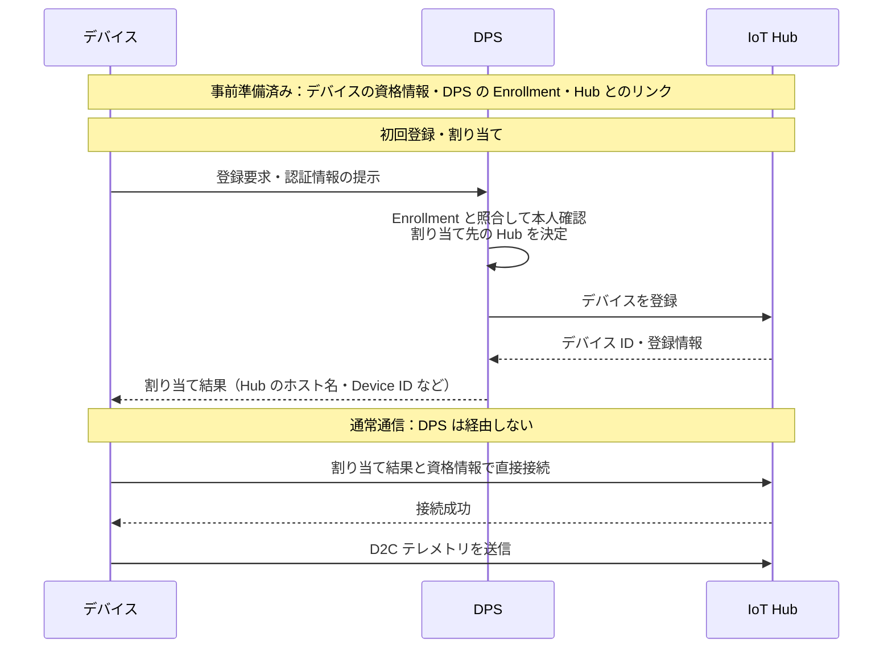

# 7. 非機能要件と本番化ベストプラクティス

## この章の目的
IoT Hub を本番利用する際に、セキュリティ、信頼性、性能、運用、コストをどのように優先度付きで考えるかを理解する。

## 聞き手に持ち帰ってほしいこと
- 非機能要件は抽象語ではなく、測定可能な目標、判断基準、責任者まで定義する
- 重要度は Microsoft Learn の公式分類ではなく、実務上のリスクに基づく判断ガイドとして扱う
- 本番移行前に未定義だと事故・障害・復旧不能に直結しやすい項目から優先する
- 多数台の運用では、DPS による初回登録・割り当てと、登録後の設定・更新・監視・廃棄を分けて設計する

## 重要度の考え方
非機能要件は「高可用」「安全」といった抽象語ではなく、測定可能な目標、障害時の判断基準、責任者まで定義する。Azure Well-Architected Framework の 5 つの柱を使うと、セキュリティだけに偏らず設計できる。

ここで示す重要度は、Microsoft Learn に項目ごとの公式優先度として記載されているものではない。Azure Well-Architected Framework、IoT Hub のセキュリティ・信頼性・スケーリング・監視に関する推奨事項を踏まえ、本番移行時に未定義だと実務上のリスクが高い順に整理したワークショップ向けの判断ガイドである。

| 重要度 | 意味 | 判断の目安 |
| --- | --- | --- |
| 必須 | 本番前に決めていないと事故・障害・運用不能につながりやすい | セキュリティ侵害、データ損失、長時間停止、復旧不能に直結する |
| 推奨 | 初期リリース時点で方針を決め、早期に整備したい | 問題発生時の検知・調査・スケール・コスト管理に影響する |
| 発展 | 規模拡大、複数拠点、本格運用で重要になる | 運用品質、効率、標準化、継続改善に効いてくる |

## 最初に決める要件
| 重要度 | 観点 | 要件定義の例 | 設計へ反映する項目 |
| --- | --- | --- | --- |
| 必須 | セキュリティ | デバイスなりすましを防止し、侵害時に 30 分以内に接続を無効化できる | デバイス固有 ID、認証方式、失効手順、RBAC、ネットワーク制御 |
| 必須 | 信頼性 | 月間可用性目標、許容停止時間、許容データ損失量を定める | SLO、RTO、RPO、再接続、バッファリング、リージョン障害対策 |
| 必須 | データ管理 | データ分類、保存場所、保持期間、削除要件を定める | 暗号化、アクセス制御、保持・削除、スキーマ、監査証跡 |
| 推奨 | 性能・拡張性 | 台数、送信頻度、メッセージサイズ、ピーク時遅延を定める | SKU、ユニット数、クォータ、負荷試験、スケール手順 |
| 推奨 | 運用性 | 障害検知時間、復旧時間、ログ保持期間を定める | メトリック、ログ、アラート、ダッシュボード、Runbook |
| 推奨 | コスト | 月額上限と、デバイス 1 台当たりの目標原価を定める | メッセージ量、ユニット数、保存期間、ログ量、通信量 |

数値は例であり、IoT Hub の SLA をそのままシステム全体の SLO にしない。デバイス、ネットワーク、IoT Hub、ルーティング先、可視化までのエンドツーエンドで定義する。

## セキュリティ
### デバイスと資格情報
- [必須] デバイスごとに一意の ID と資格情報を割り当て、資格情報を複数デバイスで共有しない
- [必須] 認証方式は脅威モデル、デバイス性能、製造工程、更新可能性を踏まえて選ぶ
- [推奨] 本番では X.509 証明書や TPM などのハードウェア保護を検討し、秘密鍵を安全な領域に保持する
- [必須] 証明書やキーの発行、更新、ローテーション、失効、廃棄までをライフサイクルとして設計する
- [必須] 侵害、盗難、廃棄時に対象デバイスだけを迅速に無効化できる手順を用意する
- [推奨] 署名検証、セキュアブート、更新失敗時のロールバックを含む安全なファームウェア更新を設計する

### プロビジョニングとアクセス制御
- [推奨] 大量デバイスでは Device Provisioning Service（DPS）を利用し、初回認証と接続先 IoT Hub の割り当てを自動化する
- [必須] 製造、物流、設置、保守、廃棄の各工程で、誰が資格情報を扱うかを明確にする
- [必須] クラウド側のアクセスには Microsoft Entra ID、Azure RBAC、マネージド ID を優先し、最小権限を適用する
- [必須] 共有アクセスポリシーを利用する場合は用途ごとに分離し、接続文字列をソースコードやログへ残さない

### 多数台の登録とライフサイクル管理

デモで体験した手動登録を出発点に、「台数が増えたとき、誰が初期アプリや資格情報を準備し、登録・交換・廃棄を管理するか」を問いかける。初回登録の自動化を、デバイスの運用全体の一部として説明する。

#### DPS による初回登録と接続先の割り当て

手動で IoT Hub にデバイスを登録する代わりに、DPS（Device Provisioning Service）で登録と接続先の割り当てを自動化できます。デバイスからの要求を確認した DPS が IoT Hub にデバイスを登録し、割り当て結果を返します。その後、デバイスは IoT Hub に直接接続します（[DPS の動作](https://learn.microsoft.com/ja-jp/azure/iot-dps/about-iot-dps#how-device-provisioning-service-works)）。

事前に、デバイスへ初期アプリ・資格情報・DPS の接続情報を用意し、クラウド側で DPS の Enrollment と IoT Hub とのリンクを設定します。**Enrollment は登録を許可するための事前設定であり、IoT Hub のデバイス登録とは別です**（[DPS の事前準備](https://learn.microsoft.com/ja-jp/azure/iot-dps/about-iot-dps#how-device-provisioning-service-works)、[Enrollment の意味](https://learn.microsoft.com/ja-jp/azure/iot-dps/concepts-service#enrollment)）。

次の図は初回登録が成功する場合の概念的な流れです。認証方式ごとのやり取りや登録結果のポーリングは省略しています（[DPS の登録フロー](https://learn.microsoft.com/ja-jp/azure/iot-dps/about-iot-dps#how-device-provisioning-service-works)）。

座学ではこの図を使い、「誰が Hub に登録するか」「登録後は誰と通信するか」を説明します。DPS の作成操作や認証方式の詳細は扱わず、Private Endpoint などの通信経路の話は本章のネットワーク要件と分けて考えます。この図は閉域接続の構成を表すものではありません。

#### 直接登録・DPS の個別登録・グループ登録の使い分け

「DPS でも 1 台ずつ個別登録するなら、IoT Hub に直接登録するのと何が違うか」を問いかける。**個別登録では Enrollment の件数は減らないが、デバイスの本人確認と接続先 IoT Hub の決定を分離できる**。デバイスには資格情報と DPS の接続情報を事前設定し、接続先の Hub はプロビジョニング時に割り当てる（[Enrollment の種類](https://learn.microsoft.com/ja-jp/azure/iot-dps/concepts-service#enrollment)、[DPS の動作と利用シナリオ](https://learn.microsoft.com/ja-jp/azure/iot-dps/about-iot-dps)）。

次の表は、公式の登録方式と DPS の利用シナリオを踏まえた、本ワークショップでの選択の目安である（[Enrollment の種類](https://learn.microsoft.com/ja-jp/azure/iot-dps/concepts-service#enrollment)、[DPS の利用シナリオ](https://learn.microsoft.com/ja-jp/azure/iot-dps/about-iot-dps#when-to-use-device-provisioning-service)）。

| 観点 | IoT Hub への直接登録 | DPS の個別登録 | DPS のグループ登録 |
| --- | --- | --- | --- |
| クラウド側の事前準備 | 対象 Hub にデバイス ID を登録 | DPS にデバイスごとの Enrollment を用意 | DPS に共通の認証方式に基づく登録グループを用意 |
| 接続先の決定 | 対象 Hub の接続情報をデバイスに設定 | DPS が登録設定・割り当てポリシーに基づいて決定 | DPS が登録設定・割り当てポリシーに基づいて決定 |
| 主な利点 | DPS を追加せず、構成をシンプルにできる | 1 台ずつ管理しながら、Hub への登録・初期設定・割り当てを自動化できる | 多数のデバイスの登録許可・初期設定をグループ単位で管理できる |
| 向いているケース | 少数台・接続先固定の検証 | 出荷先が決まってから Hub を割り当てたい機器、個別設定が必要な機器 | 共通の初期設定や同じテナントに属する多数の機器 |

例えば、「機器は 1 台ずつ管理するが、出荷先の顧客が決まるまで接続先の Hub は決めない」場合は、個別登録でも DPS を使う意味がある。**登録エントリの管理をまとめることと、接続先をデバイスに固定しないことは別の利点**として説明する。グループ登録でも各デバイスの資格情報の準備は必要であり、全機器で同じ秘密情報を使い回す意味ではない（[DPS の事前準備と利用シナリオ](https://learn.microsoft.com/ja-jp/azure/iot-dps/about-iot-dps)、[登録グループの認証](https://learn.microsoft.com/ja-jp/azure/iot-dps/concepts-service#enrollment-group)）。

個別登録・グループ登録のどちらも再プロビジョニング ポリシーを利用できる。ただし、設定変更だけで接続中のデバイスが即座に別の Hub へ移るわけではなく、デバイスから DPS に再度プロビジョニング要求を送る処理が必要である（[再プロビジョニング ポリシー](https://learn.microsoft.com/ja-jp/azure/iot-dps/concepts-device-reprovision#reprovisioning-policies)）。

#### 登録後の運用につなげる

本ワークショップでは、登録の自動化だけで本番運用が完成したとせず、次の設計事項につなげる。

- 設定変更: Section 04 の Desired / Reported を踏まえ、対象デバイスと適用結果の確認方法を決める。
- 更新・監視: アプリやファームウェアの更新、失敗時の復旧、稼働状況の監視について担当者と手順を決める。
- 交換・廃棄: 新しいデバイスの準備だけでなく、古いデバイスの接続停止と再登録防止まで確認する。

利用終了時には DPS の Enrollment と IoT Hub のデバイス ID の両方を扱います。DPS 側だけの無効化・削除では既存の IoT Hub 登録は削除されず、IoT Hub 側だけの削除では DPS 経由で再登録される可能性があります。登録グループの場合も含め、認証方式に応じた解除手順を確認します（[DPS と IoT Hub のプロビジョニング解除](https://learn.microsoft.com/ja-jp/azure/iot-dps/how-to-unprovision-devices)）。

### 配送先への認証・権限

[Section 05 のルーティング](../05-message-routing/outline.md)を例に、接続ごとの主体と権限を区別する。デバイスが IoT Hub に接続できることと、IoT Hub が Storage に書き込めることは別である。Portal を操作するユーザーと、配送に使うマネージド ID も別の主体として扱う（[IoT Hub のマネージド ID による配送先アクセス](https://learn.microsoft.com/ja-jp/azure/iot-hub/iot-hub-managed-identity#configure-message-routing-with-managed-identities)）。

| 接続・操作 | 主体 | 確認する権限 |
| --- | --- | --- |
| デバイスから IoT Hub への送信 | デバイス ID とその資格情報 | そのデバイスとして接続・送信できるか |
| Portal でのリソース設定 | 操作者のユーザー | リソースを設定変更できるか。ロール割り当てを行うなら、その権限もあるか |
| IoT Hub から Storage への配送 | エンドポイントで選択したマネージド ID | 配送先コンテナーにデータを書き込めるか |

マネージド ID で Storage に配送する場合は、その ID に **ストレージ BLOB データ共同作成者（Storage Blob Data Contributor）** を、配送先コンテナーを含む適切な範囲で割り当てる。通常の「共同作成者」や「ストレージ アカウント共同作成者」では代用できない。権限は IoT Hub リソース側ではなく、アクセス対象の Storage 側に対して付与する（[必要なデータアクセスロール](https://learn.microsoft.com/ja-jp/azure/iot-hub/iot-hub-managed-identity#configure-message-routing-with-managed-identities)）。

接続が拒否された場合は、次を確認する。

- エンドポイントで選択した ID と、ロールの付与先 ID が一致しているか。システム割り当て ID なら IoT Hub 自身の ID、ユーザー割り当て ID なら IoT Hub に関連付けた ID を確認する。
- ロールの対象範囲が配送先コンテナーを含んでいるか。
- ロール追加直後なら、反映まで数分待って再試行したか。
- Storage のネットワーク制限でも拒否されていないか。RBAC とネットワークの許可は別に確認する。

これらは公式のマネージド ID 設定手順とエグレス接続要件に基づく確認事項である。ネットワークを制限する構成では、信頼された Microsoft サービスの例外など、要件に合う接続許可を確認し、原因を確かめずに制限を広く解除しない（[ID・権限の設定と反映待ち](https://learn.microsoft.com/ja-jp/azure/iot-hub/iot-hub-managed-identity#configure-message-routing-with-managed-identities)、[IoT Hub から他リソースへの接続](https://learn.microsoft.com/ja-jp/azure/iot-hub/virtual-network-support#egress-connectivity-from-iot-hub-to-other-azure-resources)）。

講師の実例として、エンドポイント追加時のアクセス拒否を取り上げられる。ただし、今回の解消原因は特定できていないため、「ロールの反映待ちが原因だった」とは断定しない。座学では主体・ロール・対象範囲の関係を説明し、IAM のクリック手順やエラーの相関 ID は扱わない。

### 配送先へのネットワーク接続方式の選定

**機能として配送先に対応していても、組織のセキュリティ要件に適合するとは限らない。** 本ワークショップでは、配送先への接続方式と例外の承認を、実装前に確認する必須事項として扱う。ID に書き込み権限を付与するだけではネットワーク制限を解除できない。IoT Hub の公式資料では、Storage・Event Hubs・Service Bus への直接配送は、配送先のパブリックエンドポイントを使用し、ネットワーク制限下では信頼された Microsoft サービスの例外とマネージド ID を組み合わせる方法が案内されている（[IoT Hub から他リソースへの送信接続](https://learn.microsoft.com/ja-jp/azure/iot-hub/virtual-network-support#egress-connectivity-from-iot-hub-to-other-azure-resources)）。

#### ネットワーク例外・認証・認可を分ける

| 層 | 確認すること |
| --- | --- |
| ネットワーク | 配送先への接続経路が許可されるか。利用する例外がサービスと組織の両方で認められているか |
| 認証 | 接続元をどのマネージド ID として確認するか |
| 認可 | その ID に、配送先への書き込みに必要なデータアクセス権限があるか |

信頼された Microsoft サービスの例外は、「Azure 上のあらゆるアプリにデータアクセスを許可する」設定ではない。対象サービスのネットワークアクセスを許可するものであり、別途 ID に必要なデータアクセス権限を付与する。これは「すべてのネットワークからの接続を許可する」構成とも、Private Endpoint を使う構成とも区別する（[マネージド ID によるルーティングとネットワーク例外](https://learn.microsoft.com/ja-jp/azure/iot-hub/iot-hub-managed-identity#configure-message-routing-with-managed-identities)、[直接配送のネットワーク仕様](https://learn.microsoft.com/ja-jp/azure/iot-hub/virtual-network-support#egress-connectivity-from-iot-hub-to-other-azure-resources)）。

**ID の種類も接続条件に含める。** 公式資料には、制限されたリソースへのアクセスはシステム割り当てマネージド ID の場合に許可され、ユーザー割り当て ID では配送先のパブリックアクセスを有効にする必要があるとの注意がある。前節の権限確認だけでなく、このネットワーク条件も確認する。システム割り当て ID を使っても、直接配送が Private Endpoint 経由になるわけではない（[送信接続における ID の制約](https://learn.microsoft.com/ja-jp/azure/iot-hub/iot-hub-managed-identity#egress-connectivity-from-iot-hub-to-other-azure-resources)、[IoT Hub の送信接続](https://learn.microsoft.com/ja-jp/azure/iot-hub/virtual-network-support#egress-connectivity-from-iot-hub-to-other-azure-resources)）。

上記のネットワーク例外の説明は Storage・Event Hubs・Service Bus を対象とする。Cosmos DB など別の配送先にも同じ設定がそのまま適用できると一般化せず、配送先ごとの認証方式・ネットワーク仕様を確認する（[IoT Hub の配送先ごとの仕様](https://learn.microsoft.com/ja-jp/azure/iot-hub/iot-hub-devguide-endpoints#custom-endpoints-for-message-routing)）。

#### 直接配送と受信アプリの判断

次は公式の一律の推奨順位ではなく、機能要件・ネットワーク要件・運用負担を合わせた、本ワークショップでの判断ガイドである。

| 条件 | 構成の候補 | 判断のポイント |
| --- | --- | --- |
| フィルターと配送で目的を満たし、対応するネットワーク例外を組織が承認できる | IoT Hub の直接ルーティング | 保存のためだけの独自受信アプリを追加せずに済む。ただし配送先の権限、処理能力、監視は必要 |
| 配送先への接続が Private Endpoint 経由のみでなければならない | VNet 内の受信アプリから組み込みエンドポイントを読み、保存先へ書き込む | 接続経路だけでなく、受信・保存処理の運用も引き受ける |
| 保存前に複雑な加工や外部データとの突き合わせが必要 | 受信・処理アプリを介する | ネットワーク要件とは別に、必要な処理機能から構成を選ぶ |

プライベート接続の例は、VNet 内の受信アプリが IoT Hub の組み込み Event Hubs 互換エンドポイントへ Private Endpoint 経由で接続して読み取り、Storage の Blob 用 Private Endpoint 経由で書き込む構成である。IoT Hub の Private Endpoint は IoT Hub に接続する側の入口であり、IoT Hub の直接配送を顧客 VNet 経由にするものではない。両サービスの名前解決・経路・権限を確認する。デバイスから IoT Hub への経路も閉域化する場合は、別途 VPN や ExpressRoute などを含めて設計する（[IoT Hub の Private Link と組み込みエンドポイント](https://learn.microsoft.com/ja-jp/azure/iot-hub/virtual-network-support)、[Storage の Private Endpoint と DNS](https://learn.microsoft.com/ja-jp/azure/storage/common/storage-private-endpoints)）。

受信アプリを追加する場合は、再試行、処理済み位置のチェックポイント、重複対策、監視、実行基盤の保守と費用も比較する。組み込みエンドポイントの保持期間は既定1日・最大7日であり、停止から復旧して未処理分に追い付く時間も考慮する。チェックポイントは保持期限が切れたデータを復元するものではない（[保持期間の仕様](https://learn.microsoft.com/ja-jp/azure/iot-hub/iot-hub-devguide-messages-read-builtin)、[読み取り位置とチェックポイント](https://learn.microsoft.com/ja-jp/azure/event-hubs/event-hubs-features#event-consumers)）。

#### 設計初期に合意すること

- [必須] 「一般公開を禁止する」のか「Private Endpoint 経由のみとする」のかを明確にし、ネットワーク管理者・セキュリティ担当者と許容する接続方式を合意する。
- [必須] Azure Policy などの組織ポリシー、配送先の例外対応、ID の種類、データアクセス権限を確認する。接続を成立させるための全ネットワーク許可を既定の解決策にしない。
- [必須] 採用する接続方式と、例外が必要ならその対象・承認者・見直し条件を記録する。本番移行前に、ポリシー適用下で配送・保存まで検証する。
- [推奨] 直接配送と受信アプリを介する構成を、運用責任・監視・障害復旧・費用も含めて比較する。

講師の実例は「学習環境では組織のネットワーク制約により保存確認を保留した」として扱い、接続成功や保存成功を実証したとは説明しない。個別のアクセス拒否の根本原因と、一般的なサービス仕様は分けて説明する。座学では「要件を満たせるなら直接配送を候補にし、Private Endpoint 必須や独自処理が必要なら受信アプリを検討する」とまとめる。

### ネットワークとデータ保護
- [必須] TLS を使用し、利用する TLS バージョンと暗号スイートをデバイス互換性も含めて確認する
- [推奨] 要件に応じて IP フィルター、Private Link、パブリックネットワークアクセスの無効化を検討する
- [推奨] Private Link を採用する場合は、現場ネットワークからプライベートエンドポイントまでの DNS と経路も設計する
- [必須] テレメトリに個人情報や機密情報を含める必要性を見直し、データ最小化、暗号化、保持、削除、監査を設計する

## 信頼性と事業継続
- [必須] 可用性 SLO、RTO、RPO を業務影響から決め、通常障害とリージョン障害を分けて考える
- [必須] デバイスとバックエンドの両方で一時的障害を想定し、指数バックオフとジッターを伴う再試行を実装する
- [推奨] 再接続集中を避けるため、接続間隔を分散し、再起動後も同時接続しないようにする
- [必須] デバイス側で必要な期間のデータをバッファし、再送時の重複をイベント ID などで処理する
- [推奨] 順序の入れ替わり、遅延、欠損を前提に、発生時刻とスキーマバージョンをメッセージに含める
- [発展] 可用性ゾーン対応を含むリージョン要件を確認し、DPS による複数 Hub への割り当てを検討する
- [発展] IoT Hub だけでなく、ルーティング先や業務処理を含むフェールオーバー手順を定期的に演習する

### 制御要求の再試行と重複実行

[Section 04](../04-device-control-state-sync/outline.md)で扱った「結果を確認できない」と「実行されていない」の違いを、再試行の設計につなげる。Direct Method は応答期限内に応答がなければ HTTP 504 となるが、デバイス側では操作を実行済みの可能性がある。C2D も少なくとも 1 回の配送を前提とするため、重複受信に備える（[Direct Method の応答仕様](https://learn.microsoft.com/ja-jp/azure/iot-hub/iot-hub-devguide-direct-methods#invoke-a-direct-method-from-a-back-end-app)、[C2D の配送とメッセージのライフサイクル](https://learn.microsoft.com/ja-jp/azure/iot-hub/iot-hub-devguide-messages-c2d)）。

次は、本ワークショップでの設計上の判断ガイドである。

- [必須] 応答タイムアウトを未実行とみなして、無条件に同じ操作を再送しない。状態・処理結果の確認方法と再試行条件を決める。
- [必須] 再実行しても結果が変わらない操作（冪等な操作）を優先する。例: 「開始状態にする」と「開始・停止を反転する」では、後者は二重実行で結果が変わる。
- [推奨] 重複実行が許されない操作では、アプリ独自の操作 ID と処理済み結果を記録する。同じ論理操作の再試行には同じ ID を使い、ID を付けるだけでなく受信側で重複を判定する。
- [推奨] 再試行回数・間隔・期限を決め、C2D では遅れて届いた操作を実行してよいかも確認する。

座学では「実行済みだが応答が返らず、再試行で二重実行になる」例を短く説明する。処理済み記録の永続化や、重複判定と実行の一貫性を保つ具体的な実装は発展事項とする。

## 性能とスケーラビリティ
- [必須] 現在値だけでなく、将来のデバイス台数、送信頻度、メッセージサイズ、ピーク係数から容量を見積もる
- [必須] Basic は主に D2C の一方向シナリオ向けであり、C2D、Device Twin、Direct Method を使う場合は Standard を選ぶ
- [必須] 日次メッセージ上限に加え、操作別のスロットリング、同時接続、ルーティング先の処理能力を確認する
- [推奨] 通常負荷、ピーク負荷、切断後の再接続集中、ルーティング先停止を負荷試験に含める
- [必須] `429` などの一時エラーでは即時連打を避け、バックオフとジッターを伴って再試行する
- [推奨] 容量のしきい値と、ユニット追加や分割を判断する責任者・手順を事前に定める

## 監視と運用
- [必須] Azure Monitor のメトリックで接続デバイス数、メッセージ数、認証エラー、スロットリング、ルーティング遅延・失敗を監視する
- [推奨] 診断設定で必要なリソースログを Log Analytics などへ送信し、保持期間とコストを決める
- [必須] 技術メトリックに加え、「デバイスから一定時間データが来ない」など業務視点の監視を設ける
- [必須] アラートには重要度、通知先、一次対応者、判断基準、Runbook を関連付ける
- [推奨] デバイス、IoT Hub、ルーティング先、保存・分析サービスを相関できるイベント ID と時刻を持たせる
- [発展] IaC と変更管理を用いて環境差分を抑え、証明書更新、容量変更、障害復旧を定期的に訓練する

## コスト最適化
- [必須] コストを「接続台数」だけでなく、送信頻度、メッセージサイズ、IoT Hub ユニット、ルーティング先、保存、ログ、ネットワークで見積もる
- [推奨] 必要な鮮度から送信頻度を決め、変化がないデータの抑制、エッジ集約、バッチ化を検討する
- [必須] 平均負荷だけで過剰構成せず、ピーク時の SLO とスロットリング余裕を満たす最小容量を選ぶ
- [必須] テレメトリ、監査ログ、診断ログごとに保持期間と保存先を分ける
- [推奨] 予算、タグ、コストアラートを設定し、デバイス 1 台当たりや工場 1 拠点当たりの単価を継続的に確認する
- [推奨] コスト削減がセキュリティ、信頼性、データ品質を損なわないかをトレードオフとして記録する

## 話す流れ
1. 重要度は公式分類ではなく、実務上のリスクに基づく整理であると明示する
2. 「未定義だと事故になるもの」から必須として説明する
3. セキュリティ、信頼性、データ管理を最初に押さえる
	- デモの手動登録から多数台の運用へ話を広げ、DPS のシーケンス図で初回登録と通常通信を区別する。続けて直接登録・個別登録・グループ登録を比較し、登録後の設定・更新・監視・廃棄につなげる
	- セキュリティでは、Section 05 の Storage 配送を例に、デバイス・Portal 操作者・IoT Hub のマネージド ID の権限を区別する
	- 続けて、権限とネットワーク到達性を区別し、承認された例外による直接配送と、Private Endpoint 必須の場合の受信アプリ構成を比較する
	- 信頼性では、Section 04 の応答タイムアウトを例に、再試行前の結果確認と重複実行対策を説明する
4. 性能、運用、コストは初期リリース時点で方針を決めるものとして説明する
5. 発展項目は規模拡大や本格運用で効いてくるものとして位置づける

## スライド構成案
| Slide | タイトル | 目的 | レイアウト / ビジュアル | 主なメッセージ |
| --- | --- | --- | --- | --- |
| 1 | 非機能要件はリスクから優先する | 重要度分類の位置づけを明確にする | 必須 / 推奨 / 発展の 3 段階ピラミッド | 重要度は公式分類ではなく、実務リスクに基づく判断ガイドである |
| 2 | 最初に決める要件 | 本番前に優先すべき観点を俯瞰する | セキュリティ、信頼性、データ管理を上段に置いた表 | 未定義だと事故・障害・復旧不能に直結するものを先に決める |
| 3 | セキュリティの必須項目 | デバイスと資格情報のリスクを説明する | デバイス ID、資格情報、失効、最小権限のアイコン列 | デバイス単位の認証、資格情報管理、失効手順は本番前に決める |
| 4 | 多数台の初回登録を DPS で自動化する | 手動登録から本番のライフサイクル管理につなげる | デバイス・DPS・IoT Hub のシーケンス図 | DPS が Hub に登録し、その後の直接通信・運用は別に設計する |
| 5 | 個別登録でも DPS を使う意味はあるか | 台数だけでなく接続先の割り当て・変更要件から選ぶ | 直接登録・DPS 個別登録・グループ登録の比較表 | 登録管理の集約と接続先の分離は別の利点である |
| 6 | 信頼性・性能の必須項目 | 停止・欠損・スロットリングへの備えを説明する | SLO/RTO/RPO と容量見積もりを並べたカード | IoT Hub 単体ではなく、エンドツーエンドで目標と容量を定義する |
| 7 | 監視・運用・コスト | 初期リリース時点で方針を決める項目を整理する | メトリック、アラート、Runbook、予算のカード | 動いてから考えるのではなく、検知・対応・費用を事前に設計する |
| 8 | 本番移行判定チェックリスト | 最後の確認観点を示す | 重要度付きチェックリスト | 必須項目が未定義なら、本番移行のリスクが高い |

## 本番移行判定
| 重要度 | チェック項目 |
| --- | --- |
| 必須 | 脅威モデルとデータ分類がレビュー済みである |
| 必須 | デバイス固有の ID、認証、資格情報更新・失効手順がある |
| 必須 | 配送先への接続方式と必要なネットワーク例外が承認され、組織ポリシー適用下で認証・認可・配送・保存を検証している |
| 必須 | SLO、RTO、RPO と責任分界が合意されている |
| 必須 | デバイス廃棄まで含むライフサイクル責任者が決まっている |
| 推奨 | 容量見積もりとピーク・再接続負荷試験が完了している |
| 推奨 | 監視、アラート、Runbook、連絡体制が動作確認済みである |
| 推奨 | 月額予算、ログ・データ保持、コストアラートが設定されている |
| 発展 | バックアップではなく、実際の復旧・フェールオーバー演習が完了している |

## 図・デモで見せるもの
- 必須 / 推奨 / 発展の 3 段階ピラミッド
- DPS の初回登録から IoT Hub への直接接続までのシーケンス図（操作デモは追加しない）
- IoT Hub への直接登録・DPS の個別登録・グループ登録の比較表
- Well-Architected Framework の 5 つの柱と IoT の具体項目を対応させた表
- 本番移行判定チェックリスト

## 強調するポイント
- 「高可用」「安全」ではなく、SLO、RTO、RPO、責任者、対応手順まで落とす
- DPS が登録・割り当てを担当し、その後の通常通信はデバイスと IoT Hub が直接行う（[DPS の動作](https://learn.microsoft.com/ja-jp/azure/iot-dps/about-iot-dps#how-device-provisioning-service-works)）
- IoT Hub の SLA をそのままシステム全体の SLO にしない
- デバイス、ネットワーク、IoT Hub、ルーティング先、可視化までをエンドツーエンドで考える
- 配送先への認証・認可とネットワーク到達性を分け、接続方式を組織ポリシーと運用負担から決める
- 応答がないことを未実行と決めつけず、再試行と重複実行をセットで設計する

## よくある誤解
- Microsoft Learn に項目ごとの必須・推奨が明示されている
- DPS に登録要求を送れば、事前設定のないデバイスでも無条件に登録される
- DPS 経由で登録したデバイスは、通常のテレメトリも DPS 経由で送る
- DPS の個別登録は、IoT Hub への直接登録と同じなので使う意味がない
- DPS の割り当て設定を変えれば、デバイスからの再要求なしで接続先が即座に切り替わる
- IoT Hub が高可用ならシステム全体も高可用である
- コスト最適化は本番稼働後に考えればよい
- Portal 操作者が Storage にアクセスできれば、IoT Hub からも書き込める
- 通常の「共同作成者」を付与すれば、Blob のデータ書き込み権限も満たせる
- マネージド ID に権限を付与すれば、配送先のネットワーク制限も通過できる
- IoT Hub に Private Endpoint を作れば、Storage への直接配送も Private Endpoint 経由になる
- 信頼されたサービスの例外は、すべての Azure アプリにデータアクセスを許可する設定である

## 理解度確認
- 重要度は公式分類か、実務上の判断ガイドか
- 本番前に必ず決めるべきセキュリティ項目は何か
- DPS を利用する場合、誰が IoT Hub にデバイスを登録し、登録後のデバイスはどこへテレメトリを送るか
- DPS の個別登録は、IoT Hub への直接登録と比べて何を分離・自動化できるか。逆に、直接登録で十分なのはどのような場合か
- 登録を自動化した後も、設定・更新・監視・交換・廃棄について何を決める必要があるか
- マネージド ID で IoT Hub から Storage に配送する場合、誰に、どのロールを、どの範囲で付与するか
- 信頼されたサービスの例外、マネージド ID による認証、データアクセス権限は、それぞれ何を許可・確認するか
- 配送先への Private Endpoint 接続が必須の場合、どの構成を候補にし、どの運用負担が増えるか
- IoT Hub の SLA とシステム全体の SLO はなぜ同じではないのか
- 「開始状態にする」と「開始・停止を反転する」では、再試行時のリスクがどう違うか

## 参考リンク
- [DPS の概要と登録フロー](https://learn.microsoft.com/ja-jp/azure/iot-dps/about-iot-dps)
- [DPS の Enrollment](https://learn.microsoft.com/ja-jp/azure/iot-dps/concepts-service#enrollment)
- [DPS の再プロビジョニング](https://learn.microsoft.com/ja-jp/azure/iot-dps/concepts-device-reprovision)
- [DPS と IoT Hub のプロビジョニング解除](https://learn.microsoft.com/ja-jp/azure/iot-dps/how-to-unprovision-devices)
- [IoT Hub のマネージド ID と配送先へのアクセス](https://learn.microsoft.com/ja-jp/azure/iot-hub/iot-hub-managed-identity)
- [IoT Hub の Private Link と送信接続](https://learn.microsoft.com/ja-jp/azure/iot-hub/virtual-network-support)
- [Azure Storage の Private Endpoint](https://learn.microsoft.com/ja-jp/azure/storage/common/storage-private-endpoints)
- [Azure Well-Architected Framework とは](https://learn.microsoft.com/ja-jp/azure/well-architected/what-is-well-architected-framework)
- [Azure IoT Hub のデプロイをセキュリティで保護する](https://learn.microsoft.com/ja-jp/azure/iot-hub/secure-azure-iot-hub)
- [IoT ソリューションをセキュリティで保護する](https://learn.microsoft.com/ja-jp/azure/iot/iot-overview-security)
- [大規模な IoT デバイスのデプロイに関するベストプラクティス](https://learn.microsoft.com/ja-jp/azure/iot-dps/concepts-deploy-at-scale)
- [Azure IoT Hub の信頼性](https://learn.microsoft.com/ja-jp/azure/reliability/reliability-iot-hub)
- [回復性のあるアプリケーションを作成するためのデバイス再接続の管理](https://learn.microsoft.com/ja-jp/azure/iot/concepts-manage-device-reconnections)
- [IoT Hub Device Provisioning Service の高可用性とディザスター リカバリー](https://learn.microsoft.com/ja-jp/azure/iot-dps/iot-dps-ha-dr)
- [IoT Hub のレベルとサイズを選択する](https://learn.microsoft.com/ja-jp/azure/iot-hub/iot-hub-scaling)
- [IoT Hub のクォータとスロットリング](https://learn.microsoft.com/ja-jp/azure/iot-hub/iot-hub-devguide-quotas-throttling)
- [Azure IoT Hub の監視](https://learn.microsoft.com/ja-jp/azure/iot-hub/monitor-iot-hub)
