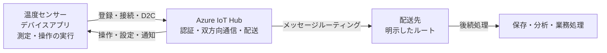

# 第08章 まとめ

## この原稿の位置づけ

- 元原稿: [outline.md](outline.md)。ワークショップ全体で扱った設計判断を、共通ユースケースに戻して振り返るスライド本文案。
- 対象者: これから Azure IoT Hub を使い始める人。第1章から第7章までの説明とデモを前提とする。
- 到達点: IoT Hub の担当範囲、通信・状態同期機能の使い分け、本番移行前に決める設計項目を自分の言葉で説明できる。
- 想定時間: 5分程度（参考値）。[アジェンダ](../../agenda.md)の方針に従い、質疑や理解度確認の時間に合わせて調整する。
- 扱わない内容: 新しい Azure サービスの紹介、個別システムの要件定義、構築手順、サービス制限値の暗記。
- 構成上の判断: 第1枚で接続から後続処理までの役割、第2枚で4つの通信・状態同期機能、第3枚で本番移行前の設計項目を回収する。前章までの内容を要約し、新しい詳細仕様は追加しない。
- 編集方法: 「投影本文」はスライドに載せる原稿、「図の構成」は配置・関係の指定、「講師ノート」は口頭補足。本文中の出典番号に対応する完全な URL を、同じスライドの出典欄と講師ノートに記載する。
- 共通の説明例: 工場に設置した温度センサーが IoT Hub へ直接接続し、テレメトリ送信、クラウドからの操作、設定同期、後続サービスへの配送を行う。
- 生成: 本ファイルは第8章の作業原稿とし、構成確定後に生成コードを作成して PowerPoint へ変換する。
- 適用したデザインガイド: [design-template.md](../../template/design-template.md)。本文16pt以上、出典10pt以上、出典番号と完全な URL の併記、編集可能な図表、右下のページ番号を適用する。
- 技術情報の確認日: 2026-09-10。

## スライド一覧

| 番号 | タイトル | 時間 | このページで新たに分かること | 主なビジュアル |
| --- | --- | --- | --- | --- |
| 08-01 | 接続から後続処理までの役割と確認点 | 1分45秒 | 各章の設計判断と、IoT Hub が担当する範囲 | 章番号付きの全体アーキテクチャ図 |
| 08-02 | D2C・Direct Method・Device Twin・C2D の使い分け | 1分30秒 | 目的、オフライン時の扱い、確認できる結果の違い | 4機能の比較表と通信方向図 |
| 08-03 | 本番移行前に決める設計項目 | 1分15秒 | デモから本番へ進む前に未定義を残さない観点 | 5領域の移行判定チェックリスト |

---

## 08-01 接続から後続処理までの役割と確認点

### このページの役割

第1章から第6章までの内容を、共通ユースケースの一つの経路へ戻して整理する。IoT Hub を中心に置きつつ、デバイス上の処理と後続サービスの処理は別の主体が担うことを再確認する。

### 投影本文

**IoT ソリューションは、接続方式の選択から後続の業務処理までを一つの経路として設計する。**

1. **接続方式を選ぶ:** 通信方式、ネットワーク、処理場所の要件を確認する。
2. **登録して接続する:** Device ID の登録と、資格情報を使ったアプリの接続を分けて確認する。[1]
3. **通信を使い分ける:** テレメトリ、即時操作、状態同期、通知を目的に合わせる。
4. **後続まで確認する:** ルートを明示し、配送先への到達と業務処理の完了を確認する。[2]

IoT Hub はデバイスの認証、双方向通信、後続サービスへのメッセージ配送を担う。デバイス上の処理と、長期保存・分析・業務処理は別のアプリやサービスが担う。[3]

**IoT Hub への送信成功だけで、デバイスでの実行や後続の業務処理まで完了したとは判断しない。**

### 図の構成

- 左から「温度センサー／デバイスアプリ」「Azure IoT Hub」「配送先」「保存・分析・業務処理」を横一列に配置する。
- デバイスから IoT Hub への矢印に「登録・資格情報・接続」「D2C」、逆向きの矢印に「操作・設定・通知」を表示する。
- IoT Hub から配送先への分岐に「メッセージルーティング」、その先に「保存・分析・業務処理」を置く。
- 図の上部に章番号付きで「第2章 接続方式」「第3章 登録・接続・D2C」「第4章 制御・状態同期」「第5章 配送」「第6章 デモ確認」を配置する。
- IoT Hub の枠内は「認証・双方向通信・配送」、デバイス側は「測定・操作の実行」、後続側は「保存・分析・業務処理」とし、担当範囲を文字でも区別する。
- 第1章の全体図を基に、要素を増やさず、今回扱った範囲と各段階の確認点を重ねる。

### 出典

[1] https://learn.microsoft.com/ja-jp/azure/iot-hub/iot-hub-devguide-identity-registry

[2] https://learn.microsoft.com/ja-jp/azure/iot-hub/iot-hub-devguide-messages-d2c

[3] https://learn.microsoft.com/ja-jp/azure/iot-hub/iot-concepts-and-iot-hub

### 講師ノート

- 目安: 1分45秒。図を左から右へ追い、各章で何を判断・確認したかを振り返る。
- 接続パターンは製品名からではなく、通信方式、ネットワーク、処理場所の要件から選ぶ。今回はクラウド直接接続を扱った。
- Hub と Device ID を作成しただけではデバイスアプリは接続しない。第6章のデモでは、接続先と資格情報を渡してアプリを起動し、接続ログと受信側を別々に確認した。
- 一つのメッセージが複数の通常ルートに一致した場合は、複数の配送先へ配送できる。各配送先での到達確認は別々に行う。
- 次への接続: 「この経路で使った4つの通信・状態同期機能を、目的と確認結果で整理します」。
- 出典: https://learn.microsoft.com/ja-jp/azure/iot-hub/iot-hub-devguide-identity-registry
- 出典: https://learn.microsoft.com/ja-jp/azure/iot-hub/iot-hub-devguide-messages-d2c
- 出典: https://learn.microsoft.com/ja-jp/azure/iot-hub/iot-concepts-and-iot-hub

---

## 08-02 D2C・Direct Method・Device Twin・C2D の使い分け

### このページの役割

第3章と第4章で扱った4つの機能を、目的、オフライン時の扱い、確認できる結果で比較する。機能名の暗記ではなく、要求と確認したい事実から選ぶことを定着させる。

### 投影本文

**通信・状態同期の機能は、届けたい内容と、どこまで結果を確認したいかで選ぶ。**

| 機能と方向 | 今回の例 | 選ぶ基準と確認する結果 |
| --- | --- | --- |
| D2C: デバイス → クラウド | 温度を送る | 受信側で送信元と本文を確認する。後続処理は別に確認する [1] |
| Direct Method: クラウド → デバイス | 今すぐ送信を止める | 接続中の即時操作と応答に使う。タイムアウトだけで未実行とは断定しない [2] |
| Device Twin: クラウド ⇄ デバイス | 送信間隔を10秒に保つ | Desired に期待値を保持し、Reported で適用結果を確認する [3] |
| C2D: クラウド → デバイス | 再接続後に診断依頼を届ける | 有効期限内のキュー配送に使い、受信・処理は別に確認する [2] |

**「送った」「応答があった」「設定が適用された」「業務処理が完了した」は、それぞれ別の確認点。**

### 図の構成

- 上部に4行の比較表を置き、「目的」「オフライン時」「確認する結果」を同じ列で対比する。
- 下部に「デバイス → IoT Hub → バックエンド」の小図を置き、D2C は右向き、Direct Method と C2D は左向きで示す。
- Device Twin は片方向のメッセージとして描かず、「クラウドが Desired を更新 → デバイスが適用 → Reported を更新」の循環で示す。
- 4機能は色だけでなく、機能名と矢印ラベルで区別する。優劣のランキングにはしない。

### 出典

[1] https://learn.microsoft.com/ja-jp/azure/iot-hub/iot-concepts-and-iot-hub

[2] https://learn.microsoft.com/ja-jp/azure/iot-hub/iot-hub-devguide-c2d-guidance

[3] https://learn.microsoft.com/ja-jp/azure/iot-hub/iot-hub-devguide-device-twins

### 講師ノート

- 目安: 1分30秒。4行を読み上げず、共通ユースケースの例と通信方向を指して使い分けを確認する。
- D2C の再送・バッファ方式は本講義で一つに固定していない。切断中のデータを失ってよいかという要件から設計する。
- Direct Method の応答は、デバイスアプリが返す内容を含む。業務上どの時点を実行完了とするかはアプリ側で定義する。
- C2D でも操作処理は実装できるが、要求と応答の形、遅れて届いた操作を実行してよいかで Direct Method と選び分ける。
- 次への接続: 「機能を選んだだけでは本番準備は完了しません。最後に、移行前に未定義を残さない観点を確認します」。
- 出典: https://learn.microsoft.com/ja-jp/azure/iot-hub/iot-concepts-and-iot-hub
- 出典: https://learn.microsoft.com/ja-jp/azure/iot-hub/iot-hub-devguide-c2d-guidance
- 出典: https://learn.microsoft.com/ja-jp/azure/iot-hub/iot-hub-devguide-device-twins

---

## 08-03 本番移行前に決める設計項目

### このページの役割

第7章の本番移行判定を、受講後に持ち帰る5領域へ絞って再提示する。デモが成功した状態と、目標値・責任者・検証結果がそろった状態を区別する。

### 投影本文

**デモで接続・送受信できても、本番移行に必要な設計と検証が完了したとは限らない。**

| 設計領域 | 本番移行前に決めること | 残す結果 |
| --- | --- | --- |
| 接続方式 | クラウド直接接続かエッジ経由か。切断時に何を継続するか | 選定理由とネットワーク検証 |
| 資格情報・自動登録 | 発行、保管、更新、失効、廃棄の担当。直接登録か Device Provisioning Service（DPS）か | ライフサイクル手順と登録試験 [1] |
| 配送先・データ | 必要なルート、保持期間、重複・遅延・順序、業務処理完了の定義 | 配送先ごとの到達・復旧試験 |
| 目標・容量・監視 | 何分以内に届けるか、何時間で復旧するか、どこまでのデータ損失を許容するか。台数、ピーク、予算、アラート | 目標値（SLO・RTO・RPO）、容量試験、監視結果 [2] |
| 責任者・復旧手順 | 障害時に誰が判断し、どの手順（Runbook）で復旧するか | 責任分界、連絡先、演習結果 |

セキュリティ、信頼性、性能、運用、コストの5観点で設計の偏りを確認する。[3]

**目的に合う接続・通信・配送を選び、業務処理の結果を確認できる運用まで設計する。**

**持ち帰る3点: 接続を選ぶ／通信を使い分ける／業務処理まで確認する。**

### 図の構成

- 中央に5行のチェックリストを置き、左から「設計領域」「決めること」「残す結果」の順に読む構成にする。
- 各行の右端に「決定済み」「検証済み」「責任者」の3つの確認欄を配置する。
- 表の下に Well-Architected Framework の5つの柱を同じ大きさで横並びにし、公式の優先順位に見せない。
- 上部に「デモ成功」、下部に「本番移行判定」を置き、チェックリストを通過して進む関係を示す。自動的に移行できる矢印にはしない。

### 出典

[1] https://learn.microsoft.com/ja-jp/azure/iot-dps/concepts-service

[2] https://learn.microsoft.com/ja-jp/azure/architecture/reference-architectures/iot

[3] https://learn.microsoft.com/ja-jp/azure/well-architected/what-is-well-architected-framework

### 講師ノート

- 目安: 1分15秒。表の全項目を読み上げず、「決めること」と「残す結果」の両方が必要だと説明する。
- DPS はデバイスを認証し、接続先 IoT Hub の割り当てと登録を自動化する。通常のテレメトリは割り当て後の IoT Hub へ直接送る。
- 再起動や一時切断のたびに再プロビジョニングするのではなく、割り当て済み Hub への再接続と、割り当てをやり直す条件を分ける。
- L200 の補足として、メッセージに時刻・スキーマバージョン・イベント ID を含め、重複・遅延・順序変更を考慮する。資格情報は製造から廃棄まで、登録集中は時間差登録・バックオフ・ジッターまで設計する。
- 締めでは、投影した3点を指し、受講後の要件整理で最初に確認する順序として再提示する。
- 出典: https://learn.microsoft.com/ja-jp/azure/iot-dps/concepts-service
- 出典: https://learn.microsoft.com/ja-jp/azure/architecture/reference-architectures/iot
- 出典: https://learn.microsoft.com/ja-jp/azure/well-architected/what-is-well-architected-framework